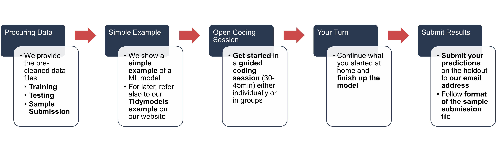
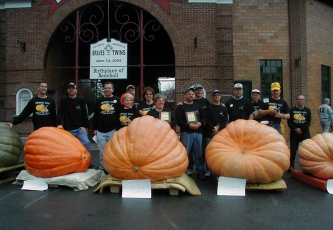

---
output:
  xaringan::moon_reader:
    css: xaringan-themer.css
    includes:
      after_body: insert-logo.html
    lib_dir: libs
    nature:
      highlightStyle: github
      highlightLines: true
      countIncrementalSlides: false
    seal: false
editor_options: 
  chunk_output_type: console
---

class: center, middle, hide-logo

```{r xaringan-themer, include=FALSE, warning=FALSE}
library(xaringanthemer)
style_mono_accent(
  base_color = "#00000e",
  header_font_google = google_font("Merriweather"),
  text_font_google   = google_font("Avenir Next"),
  code_font_google   = google_font("Fira Mono")
)
```

```{css, echo=FALSE}
pre {
  background: #F8F8F8;
  max-width: 100%;
  overflow-x: scroll;
}
```

```{css, echo=FALSE}
.scroll-output {
  height: 80%;
  overflow-y: scroll;
}
```

```{r xaringan-panelset, echo=FALSE}
xaringanExtra::use_panelset()
```

```{r setup, include=FALSE}
options(htmltools.dir.version = FALSE)

library(tidyverse)
library(tidymodels)
```

# First Machine Learning Workshop

## by

```{r, echo=FALSE, out.width="50%"}
knitr::include_graphics("GraphicsSlides/Logo RUG hell.png")
```

##### Author/Presenter: Ruben Ernst/Mathias Steilen
##### Last updated: _`r Sys.time()`_

---

# Goals for today's session

<br>
<br>
<br>

```{r, echo=FALSE, out.width="100%"}

```

---

### Today's Task

<br>
<br>

.center[
```{r, echo=FALSE, out.width="60%"}
knitr::include_graphics("GraphicsSlides/get in loser.png")
```
]

Courtesy of the TidyTuesday project - Check it out!

---

# Background

> The Great Pumpkin Commonwealth's (GPC) mission cultivates the hobby of growing giant pumpkins throughout the world by establishing standards and regulations that ensure quality of fruit, fairness of competition, recognition of achievement, fellowship and education for all participating growers and weigh-off sites.

_[Link to Website](https://gpc1.org/)_

.center[
```{r, echo=FALSE, out.width="50%"}

```
]

---

# Let's look at the files

.panelset[

.panel[.panel-name[training]

```{r}
training <- read_csv("./Data/training.csv")
```

This file will be used for training/fitting your model.

]

.panel[.panel-name[testing]

```{r}
holdout <- read_csv("./Data/holdout.csv")
```

This file will be used to make predictions on. There is no target variable in here, so there won't be data leakage during training. However, before submitting your predictions, please follow the sample submission format.

]

.panel[.panel-name[sample_submission]

```{r}
sample_submission <- read_csv("./Data/sample_submission.csv")
```

**Important**: Your submission to our email address must adhere to this format (CSV file).

]

]

---

# Our Basic Example

**Disclaimer**

--

.pull-left[

Some of you might feel like this:

.center[
```{r, echo=FALSE, out.width="75%"}

```
]

]

--

.pull-right[

And some of you might feel like this:

```{r, echo=FALSE, out.width="100%"}

```

]

--

The learning curve is always steep when looking at it from the bottom. Use the time later to ask your more experienced peers (or us) questions.

---

#### Our Basic Example: The ol' reliable

Let's fit a basic, linear regression.

```{r}
lin_spec <- linear_reg() %>%
  set_mode("regression") %>%
  set_engine("lm")
```

```{r}
lin_rec <- recipe(weight_lbs ~ year + place + ott + est_weight + country,
                  data = training) %>%
  step_impute_mean(all_numeric_predictors()) %>%
  step_unknown(all_nominal_predictors(), new_level = "not specified") %>%    
  step_other(country, threshold = 0.03) %>%
  step_dummy(all_nominal_predictors(), one_hot = T) %>% 
  step_rm(country_other)
```

---

#### Our Basic Example: The ol' reliable

```{r}
lin_rec %>% prep() %>% juice()
```

---

#### Our Basic Example: The ol' reliable

```{r}
lin_wf <- workflow() %>%
  add_recipe(lin_rec) %>%
  add_model(lin_spec)

lin_wf
```

---

#### Our Basic Example: The ol' reliable

```{r}
lin_fit <- lin_wf %>% 
  fit(training)
```

---

#### Our Basic Example: The ol' reliable

```{r}
lin_fit %>% 
  predict(holdout)
```

---

#### Our Basic Example: The ol' reliable

```{r}
lin_fit %>% 
  augment(holdout)
```

---

#### Our Basic Example: The ol' reliable

```{r}
lin_fit %>% 
  augment(read_csv("./Data/holdout_with_target.csv", show_col_types = F)) %>% 
  rsq(truth = weight_lbs, estimate = .pred)
```

---

#### Our Basic Example: The ol' reliable

.scroll-output[
```{r, dpi=300, out.width="100%", fig.height=4}
lin_fit %>% 
  augment(read_csv("./Data/holdout_with_target.csv", show_col_types = F)) %>% 
  ggplot(aes(weight_lbs, .pred)) +
  geom_point(alpha = 0.2) +
  geom_abline(lty = "dashed", colour = "red")
```
]

---

### You won't have the target variable on the holdout data set for two reasons

--

.pull-left[

.center[

**Reason 1:**

<br>

```{r, echo=FALSE, out.width="100%"}

```
]

]

--

.pull-right[

.center[

**Reason 2:**

<br>

```{r, echo=FALSE, out.width="60%"}

```
]

]

There's something to win here - so play fair.

---

### Off you go

Have a look at our example for dealing with splits and hyperparameter tuning in the Tidymodels tutoring session. Copying and pasting the code in the slides is **allowed**!

Spend 30-45 min on getting started with your model. Ask your peers (that includes us) questions. 

#### 🕒 30-45 min

---

# That's it for today!

After our session: Read up documentation on the internet. Watch videos from Julia Silge, Andrew Couch and David Robinson. Submit your entries before the deadline to our email. And most importantly, have fun while learning.

For further questions, feel free to reach out to us. Make sure to stay updated on our socials and via our website where all resources and dates are also published.

<br>

.center[
```{r, echo=FALSE, out.width="60%"}
knitr::include_graphics("GraphicsSlides/Logo RUG hell.png")
```

**[Website](https://rusergroupstgallen.github.io/) | [Instagram](https://www.instagram.com/rusergroupstgallen/?hl=en) | [Twitter](https://twitter.com/rusergroupsg)**

]

---

class: center, middle, inverse, hide-logo

# Thank you for attending!