---
output:
  xaringan::moon_reader:
    css:
      - xaringan-themer.css
      - center2.css
    includes:
      after_body: insert-logo.html
    lib_dir: libs
    nature:
      highlightStyle: github
      highlightLines: true
      countIncrementalSlides: false
    seal: false
editor_options: 
  chunk_output_type: console
---

class: center, middle, hide-logo

```{r xaringan-themer, include=FALSE, warning=FALSE}
library(xaringanthemer)
style_mono_accent(
  base_color = "#00000e",
  header_font_google = google_font("Merriweather"),
  text_font_google   = google_font("Avenir Next"),
  code_font_google   = google_font("Fira Mono")
)
```

```{css, echo=FALSE}
pre {
  background: #F8F8F8;
  max-width: 100%;
  overflow-x: scroll;
}
```

```{css, echo=FALSE}
.center2 {
  margin: 0;
  position: absolute;
  top: 50%;
  left: 50%;
  -ms-transform: translate(-50%, -50%);
  transform: translate(-50%, -50%);
}
```

```{r setup, include=FALSE}
options(htmltools.dir.version = FALSE)
```

# Writing your Thesis in RMarkdown

## by

```{r, echo=FALSE, out.width="50%"}
knitr::include_graphics("GraphicsSlides/Logo RUG hell.png")
```

##### Author/Presenter: Mathias Steilen
##### Last updated: _`r Sys.time()`_

---

# Goals for today's session

- Obvious ones:
  - Learn about RMarkdown
  - Know how to write your thesis in RMarkdown

- Less obvious ones:
  - Know about the magic of knitr (support for other formats and other programming languages)
  - Learn how to get the best of all worlds (python, R, whatever other language)

<br>

Bonus: Ready to use template from us!

---
# Why not just use Word?

Ever found yourself doing this every time you update your code?

<br>

.center[
```{r, echo=FALSE, out.width="50%"}
knitr::include_graphics("GraphicsSlides/copy-paste-paste.gif")
```
]

---

# Why not just use Word?

When using word, you're decoupling the coding and writing parts of your thesis:

.center[
```{r, echo=FALSE, out.width="80%"}
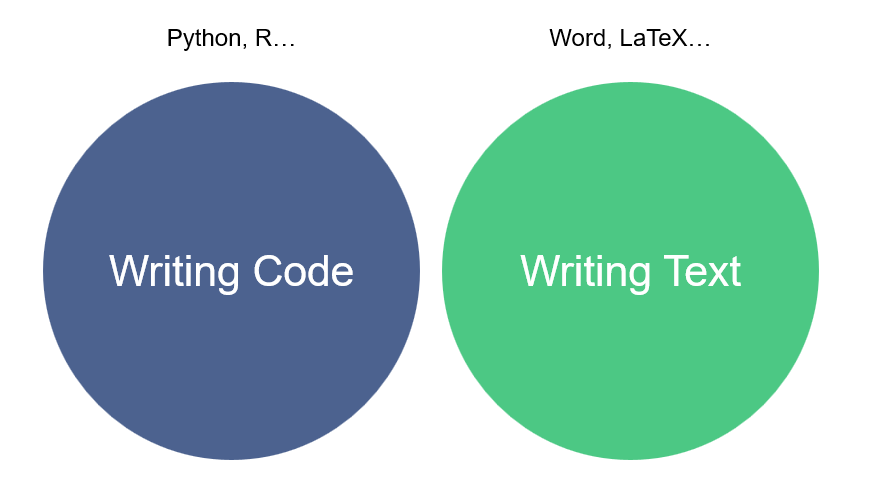
```
]

---

# Why not just use Word?

With RMarkdown, you're coding and writing in the same place.

<br>

.center[
```{r, echo=FALSE, out.width="70%"}
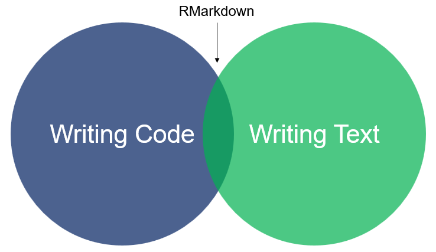
```
]

---

# Benefits of RMD over Word

.center[
```{r, echo=FALSE, out.width="40%"}

```
]

You should use RMD, if
- you want to show output from code in your thesis
- you want the practical and aesthetic benefits of LaTeX

Benefits
- no more `CTRL-C` and `CTRL-V` to reflect changes
- LaTeX is much less administrative effort for formatting/alignment in larger projects like a thesis

---

# Benefits of RMD over Word

The work process in Word (for every individual chart):

`Change Chart in R -> Write to .png -> Copy into Word -> Align`

If you realise you made a mistake in your early data preprocessing, you'll have to do it all over again for all charts every time!

--

<br>

.center[
```{r, echo=FALSE, out.width="30%"}
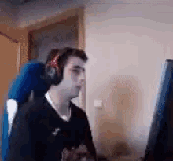
```

_Depiction of above process, 2022, colourised_
]

---

# Not in RMD!

.pull-left[
Writing your code and text in the same place means: **All changes are reflected immediately.**

If you made an error in the data preprocessing, just correct the error. End of story. No modifications to the charts are necessary.

Why? Because the code is fully executed, all charts are aligned and formatted each time you knit the document.

The keyboard stays intact.
]

.pull-right[
.center[
```{r, echo=FALSE, out.width="100%"}
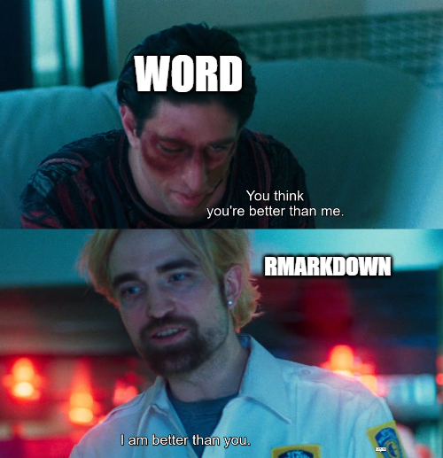
```
]
]
---

# RMarkdown

[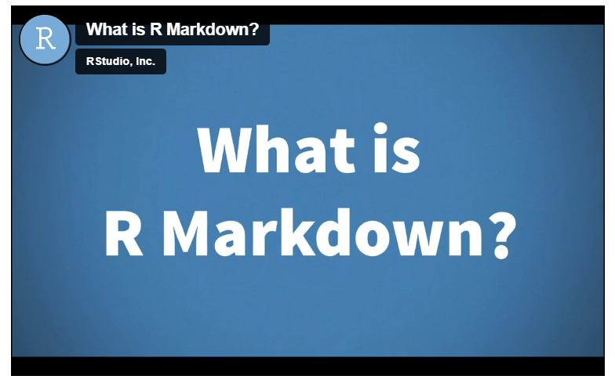](https://vimeo.com/178485416)

---

# Your turn

Open an RMarkdown file in RStudio:

`File -> New File -> RMarkdown -> Give it a title -> Choose output format PDF`

Save this document somewhere you'll find it again.

You need a LaTeX distribution to make it work. Luckily, R makes it easy for us. Run the following in your console:

```{r, eval=FALSE}
install.packages("tinytex")
tinytex::install_tinytex()
```

Then, let's inspect what we're looking at.

---

# How do you write your thesis with this?

A program for your thesis needs to fulfil the following points:

- Title page
- Table of contents
- Table of figures
- Page numbering
- Citations
- References
- ...

RMarkdown does all of this, because you can use raw LaTeX. This is where the magic happens: You can combine your code and the power of LaTeX to generate research papers.

---

class: center, middle

#### A disclaimer

```{r, echo=FALSE, out.width="50%"}
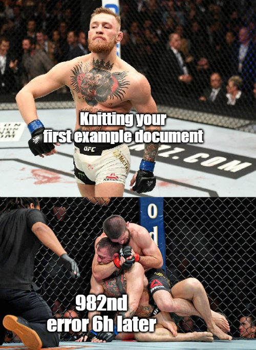
```

---

class: center, middle

.pull-left[

Fear not. We got you covered with a template:

```{r, echo=FALSE, out.width="100%"}
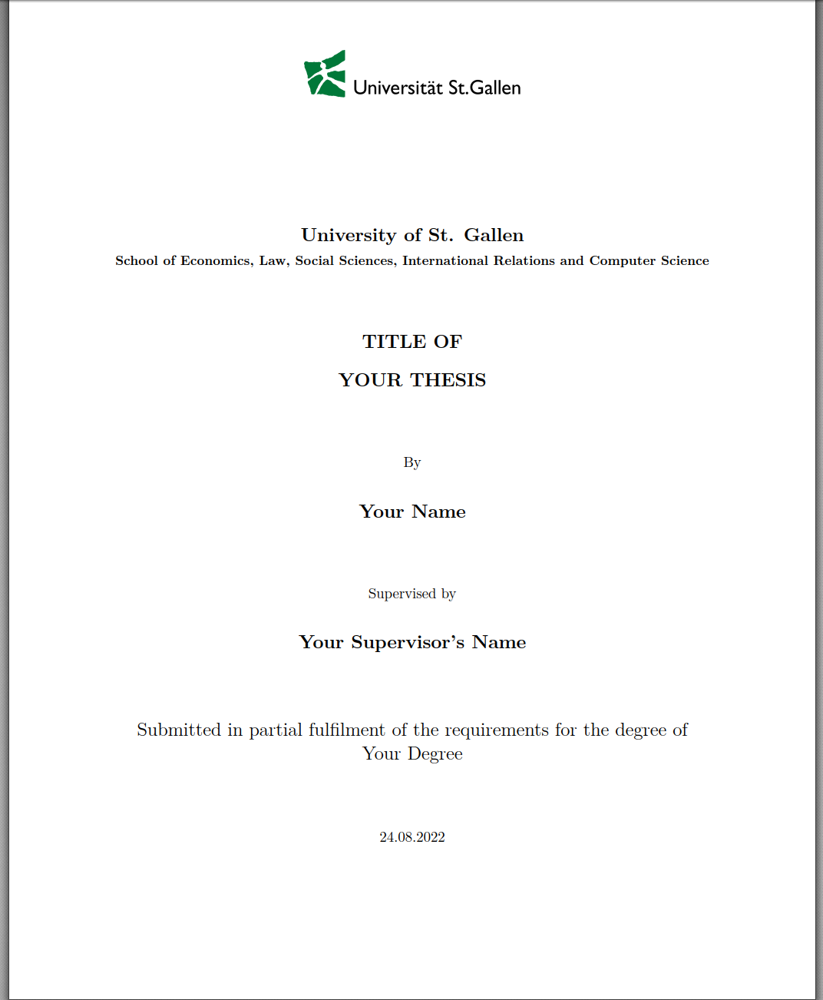
```
]

--

.pull-right[

Saves you from this:

<br>
<br>

```{r, echo=FALSE, out.width="80%"}
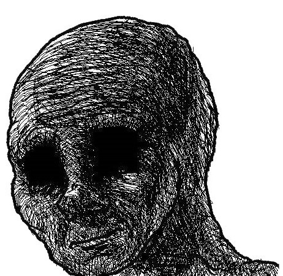
```

]
---

# Let's take a look

Download the template from the [resources](https://rusergroupstgallen.github.io/resources.html) section on our website and extract the main folder from the ZIP folder.

.center[
```{r, echo=FALSE, out.width="60%"}
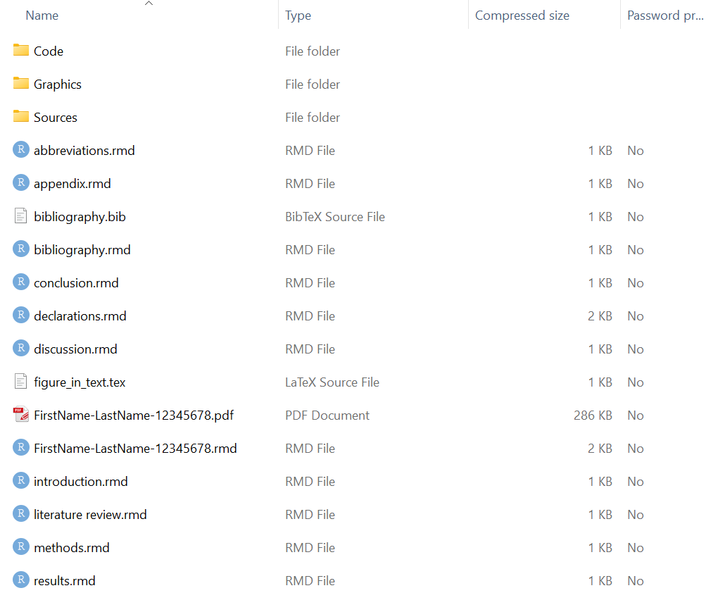
```
]

---

# The Parent Document

Open `FirstName-LastName-12345678.pdf`. Let's take a look together

.center[
```{r, echo=FALSE, out.width="40%"}

```
]

---

# The Parent Document

Open `FirstName-LastName-12345678.rmd`. Let's take a look together

<br>

.center[
```{r, echo=FALSE, out.width="100%"}
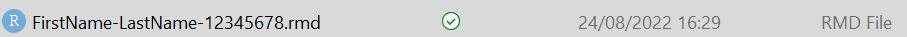
```
]

---

# The Parent Document

Let's knit it once. Doing this the first time, the LaTeX distribution first installs the necessary packages from the YAML, this takes a few minutes. The next knit will take much less time.

---

# The Children

.center[
```{r, echo=FALSE, out.width="70%"}

```
]

---

# The Children

The following chunk in the parent document "pulls in" the information in the child document. Hence, the parent functions as the global hub for knitting, also setting all formatting and applying it equally to all children.

<br>

````
```{r intro, child = 'introduction.rmd'}`r ''`
```
````

<br>

**Always knit from the parent document.** This takes a little getting used to, but you'll get around to it.

---

# Basic tools

Open `introduction.rmd` and keep the PDF open. Let's take a look at this together.

<br>

.center[
```{r, echo=FALSE, out.width="50%"}
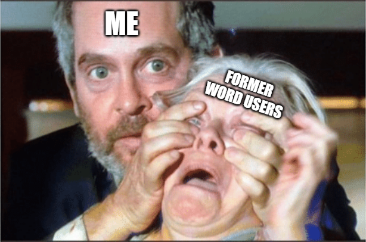
```
]

---

# So let's recap

We wanted:

- Title page
- Table of contents
- Table of figures
- Page numbering
- Citations
- References
- ...

And most importantly: No more manual copying and pasting.

---

# That's it for today!

We hope this tutorial was useful! Feel free to make use of the template and don't despair if you encounter errors. For further questions, feel free to reach out to us. Make sure to stay updated on our socials and via our website where all resources and dates are also published.

<br>

.center[
```{r, echo=FALSE, out.width="60%"}
knitr::include_graphics("GraphicsSlides/Logo RUG hell.png")
```

**[Website](https://rusergroupstgallen.github.io/) | [Instagram](https://www.instagram.com/rusergroupstgallen/?hl=en) | [Twitter](https://twitter.com/rusergroupsg)**

]

---

class: center, middle, inverse, hide-logo

# Thank you for attending!