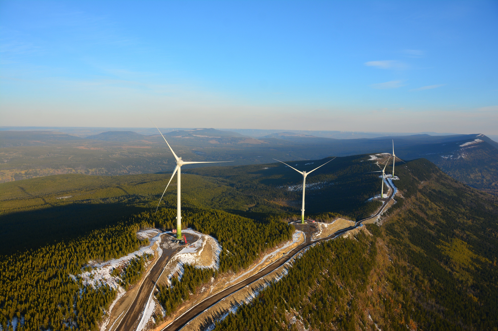
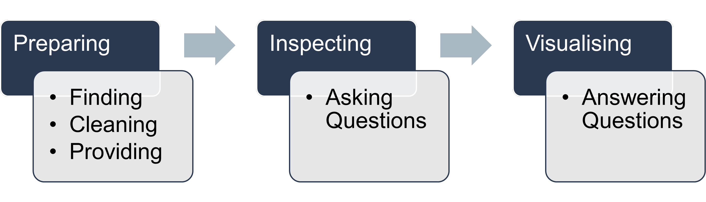
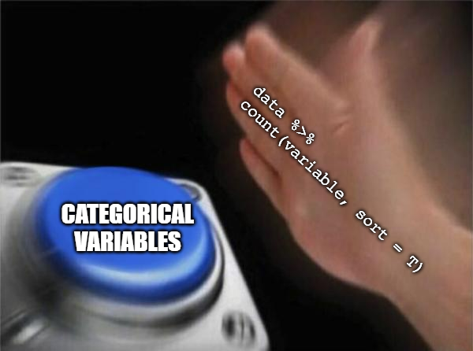
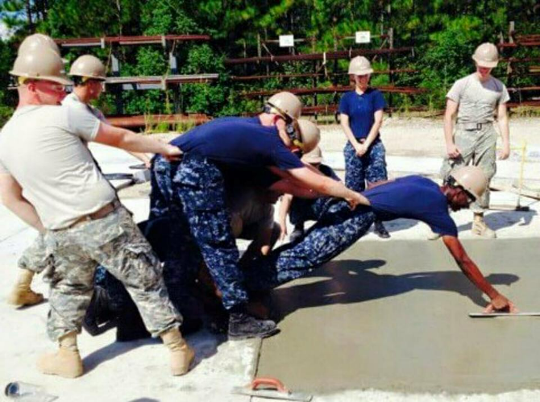

---
output:
  xaringan::moon_reader:
    css: xaringan-themer.css
    includes:
      after_body: insert-logo.html
    lib_dir: libs
    nature:
      highlightStyle: github
      highlightLines: true
      countIncrementalSlides: false
    seal: false
editor_options: 
  chunk_output_type: console
---

class: center, middle, hide-logo

```{r xaringan-themer, include=FALSE, warning=FALSE}
library(xaringanthemer)
style_mono_accent(
  base_color = "#00000e",
  header_font_google = google_font("Merriweather"),
  text_font_google   = google_font("Avenir Next"),
  code_font_google   = google_font("Fira Mono")
)
```

```{css, echo=FALSE}
pre {
  background: #F8F8F8;
  max-width: 100%;
  overflow-x: scroll;
}
```

```{css, echo=FALSE}
.scroll-output {
  height: 80%;
  overflow-y: scroll;
}
```

```{r setup, include=FALSE}
options(htmltools.dir.version = FALSE)
```

```{r xaringan-panelset, echo=FALSE}
xaringanExtra::use_panelset()
```

```{r, echo=FALSE, out.width="50%"}
knitr::include_graphics("GraphicsSlides/Logo RUG hell.png")
```

# Data Visualisation
### Canadian Wind Turbines

##### Author/Presenter: Mathias Steilen
##### Last updated: _`r Sys.time()`_

---

class: hide-logo, center, middle

```{r, echo=FALSE, out.width="100%"}

```

---

# Goals for today's session

<br>
<br>
<br>

```{r, echo=FALSE, out.width="100%"}

```

---

### Data and Libraries

```{r, cache=FALSE, eval=FALSE}
wind <- readr::read_csv('https://raw.githubusercontent.com/rfordatascience/tidytuesday/master/data/2020/2020-10-27/wind-turbine.csv')
```

```{r, echo=FALSE}
wind <- readr::read_csv('C:/Users/mathi/OneDrive/R/Data Visualisation/Canadian Wind Turbines/wind.csv')
```

```{r, message=FALSE, warning=FALSE}
library(tidyverse)
library(broom)
```

---

### The Data

```{r}
glimpse(wind)
```

---

### `commissioning_date`

The column is formatted as a character because of combinations of multiple years, but should really be a factor. For simplicity, let's just parse the first value that occurs to a new `year` column.

```{r}
wind %>% 
  filter(str_detect(commissioning_date, "/")) %>% 
  count(commissioning_date, sort = T)
```

---

### `commissioning_date`

```{r}
wind <- wind %>% 
  mutate(year = parse_number(commissioning_date) %>% as.factor)

wind %>% 
  count(year)
```

---

### Missing Values

.pull-left[

```{r, eval=FALSE, warning=FALSE}
colMeans(is.na(wind)) %>% 
  tidy() %>% 
  rename(missing = x) %>% 
  mutate(names = fct_reorder(names, missing)) %>% 
  ggplot(aes(missing, names)) +
  geom_col(fill = "#2A3950") +
  labs(title = "Missing Values",
       y = NULL) +
  scale_x_continuous(labels = scales::percent_format(),
                     limits = c(0,1)) +
  theme_light() +
  theme(plot.title = element_text(face = "bold", size = 14),
        panel.grid.major.y = element_blank())
```

]

.pull-right[

```{r, echo=FALSE, warning=FALSE, fig.height=5, fig.width=4, dpi=300}
colMeans(is.na(wind)) %>% 
  tidy() %>% 
  rename(missing = x) %>% 
  mutate(names = fct_reorder(names, missing)) %>% 
  ggplot(aes(missing, names)) +
  geom_col(fill = "#2A3950") +
  labs(title = "Missing Values",
       y = NULL) +
  scale_x_continuous(labels = scales::percent_format(),
                     limits = c(0,1)) +
  theme_light() +
  theme(plot.title = element_text(face = "bold", size = 14),
        panel.grid.major.y = element_blank(),
        panel.grid.minor.x = element_blank())
```

]

---

### Looks clean, let's collect some questions!

```{r}
wind %>% glimpse()
```

---

### Asking Questions

Take a moment to get a feel for the data set and write down questions that seem interesting to you. Examples might be: 
- Did wind turbines get taller with time? 
- How are projects distributed across Canada?

Tip: Use functions like `count()`, `group_by()`, `summarise()`, `select()`

#### 🕒 10 min

.center[
```{r, echo=FALSE, out.width="40%"}

```
]

---

### Answering Questions by Visualising

Have a look at five questions and pick your team according to your greatest interest.

Spend 30 min on creating one or multiple charts with your team. If your time is done before the time is up, feel free to join other teams.

#### 🕒 30 min

.center[
```{r, echo=FALSE, out.width="50%"}

```
]

---

### Discussion

Let's walk through your charts and discuss them. Come to the front with your computer or send the code to our email address.

#### 🕒 15 min (3 min per group)

---

### Example Question: How are wind energy projects distributed across Canada?

.center[
```{r, echo=FALSE, dpi=300, out.width="80%", fig.height=5}
canada <- map_data("world", region = "canada")

projects <- wind %>% 
  group_by(project_name) %>%
  summarise(across(c(total_project_capacity_mw, latitude,
                     longitude, year), last)) %>% 
  ungroup() %>% 
  mutate(year = as.numeric(as.character(year)),
         period = cut(year, seq(1990, 2020, 10), dig.lab = 5))

ggplot() +
  geom_polygon(data = canada, 
               aes(x = long, y = lat, group = group),
               color = "grey50", fill = "gray95", alpha = 0.3, size = 0.25) +
  geom_point(data = projects,
             aes(x = longitude, y = latitude,
                 size = total_project_capacity_mw,
                 colour = period), alpha = 0.25) +
  scale_size_continuous(range = c(0.5, 3), 
                        labels = scales::comma_format(suffix = " MW")) +
  labs(title = "Wind Energy Projects In Canada",
       subtitle = "Each dot constitutes one completed wind farm\nwith size representing production capacity",
       y = NULL,
       x = NULL,
       size = "Project Capacity:",
       colour = "Period of Construction:") +
  coord_map() +
  theme_minimal() +
  theme(panel.background = element_blank(),
        panel.grid = element_blank(),
        axis.ticks = element_blank(),
        axis.line = element_blank(),
        axis.text = element_blank(),
        plot.title = element_text(size = 12, face="bold", colour="black"),
        plot.subtitle = element_text(face = "italic", colour = "gray50")) +
  scale_colour_manual(values = c("firebrick", "darkorange",
                                 "dodgerblue4", "dodgerblue"))
```
]

---

#### _Example Question (Credit: Mathias Steilen)_

.scroll-output[
```{r, eval=FALSE, dpi=300, fig.width=7, out.height="100%"}
canada <- map_data("world", region = "canada")

projects <- wind %>% 
  group_by(project_name) %>%
  summarise(across(c(total_project_capacity_mw, latitude,
                     longitude, year), last)) %>% 
  ungroup() %>% 
  mutate(year = as.numeric(as.character(year)),
         period = cut(year, seq(1990, 2020, 10), dig.lab = 5))

ggplot() +
  geom_polygon(data = canada, 
               aes(x = long, y = lat, group = group),
               color = "grey50", fill = "gray95", alpha = 0.3, size = 0.25) +
  geom_point(data = projects,
             aes(x = longitude, y = latitude,
                 size = total_project_capacity_mw,
                 colour = period), alpha = 0.25) +
  scale_size_continuous(range = c(0.5, 3), 
                        labels = scales::comma_format(suffix = " MW")) +
  labs(title = "Wind Energy Projects In Canada",
       subtitle = "Each dot constitutes one completed wind farm with size representing production capacity",
       y = NULL,
       x = NULL,
       size = "Project Capacity:",
       colour = "Period of Construction:") +
  coord_map() +
  theme_minimal() +
  theme(panel.background = element_blank(),
        panel.grid = element_blank(),
        axis.ticks = element_blank(),
        axis.line = element_blank(),
        axis.text = element_blank(),
        plot.title = element_text(size = 12, face="bold", colour="black"),
        plot.subtitle = element_text(face = "italic", colour = "gray50")) +
  scale_colour_manual(values = c("firebrick", "darkorange",
                                 "dodgerblue4", "dodgerblue"))
```
]

---

# That's it for today!

For further questions, feel free to reach out to us. Make sure to stay updated on our socials and via our website where all resources and dates are also published. We are looking forward to welcome you to the next event!

[Data Source](https://github.com/rfordatascience/tidytuesday/blob/master/data/2020/2020-10-27/readme.md)

<br>

.center[
```{r, echo=FALSE, out.width="60%"}
knitr::include_graphics("GraphicsSlides/Logo RUG hell.png")
```

**[Website](https://rusergroupstgallen.github.io/) | [Instagram](https://www.instagram.com/rusergroupstgallen/?hl=en) | [Twitter](https://twitter.com/rusergroupsg)**

]

---

class: center, middle, inverse, hide-logo

# Thank you for attending!