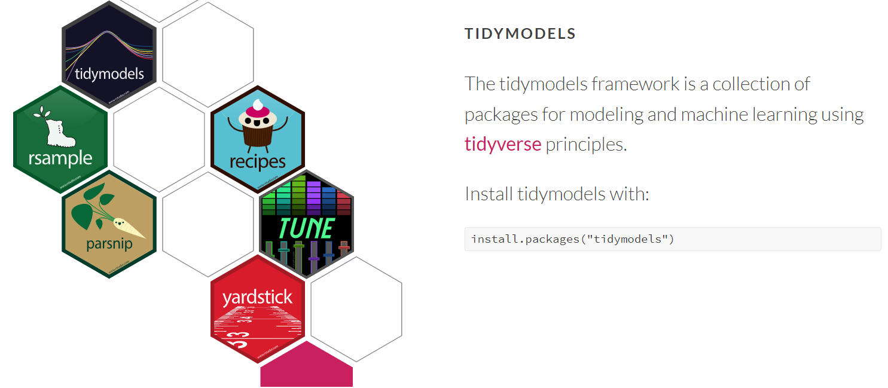
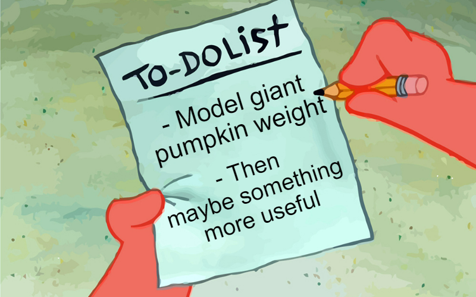
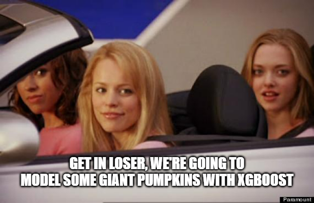

---
output:
  xaringan::moon_reader:
    css: 
      - xaringan-themer.css
      - center2.css
    includes:
      after_body: insert-logo.html
    lib_dir: libs
    nature:
      highlightStyle: github
      highlightLines: true
      countIncrementalSlides: false
    seal: false
editor_options: 
  chunk_output_type: console
---

class: center, middle, hide-logo

```{r xaringan-themer, include=FALSE, warning=FALSE}
library(xaringanthemer)
style_mono_accent(
  base_color = "#00000e",
  header_font_google = google_font("Merriweather"),
  text_font_google   = google_font("Avenir Next"),
  code_font_google   = google_font("Fira Mono")
)
```

```{css, echo=FALSE}
pre {
  background: #F8F8F8;
  max-width: 100%;
  overflow-x: scroll;
}
```

```{css, echo=FALSE}
.center2 {
  margin: 0;
  position: absolute;
  top: 50%;
  left: 50%;
  -ms-transform: translate(-50%, -50%);
  transform: translate(-50%, -50%);
}
```

```{css, echo=FALSE}
.scroll-output {
  height: 80%;
  overflow-y: scroll;
}
```

```{r setup, include=FALSE}
options(htmltools.dir.version = FALSE)
```

# Introduction to Tidymodels

## by

```{r, echo=FALSE, out.width="50%"}

```

##### Author/Presenter: Mathias Steilen
##### Last updated: _`r Sys.time()`_

---

# Tidymodels

<br>

.center[
```{r, echo=FALSE, out.width="100%"}

```

_[(Source)](https://www.tidymodels.org/)_
]

---

# Goals for this session

- Know how to model with `tidymodels` by working live on a data set
- Be able to use that knowledge and the code to apply it to other data and with other models

<br>

.center[
```{r, echo=FALSE, out.width="50%"}

```
]

---

# Today's data set

.center[
```{r, echo=FALSE, out.width="50%"}

```
]

> The Great Pumpkin Commonwealth's (GPC) mission cultivates the hobby of growing giant pumpkins throughout the world by establishing standards and regulations that ensure quality of fruit, fairness of competition, recognition of achievement, fellowship and education for all participating growers and weigh-off sites. ([TidyTuesday Link](https://github.com/rfordatascience/tidytuesday/blob/master/data/2021/2021-10-19/readme.md))

---

# Off we go

```{r, cache=TRUE}
pumpkins <- readr::read_csv('https://raw.githubusercontent.com/rfordatascience/tidytuesday/master/data/2021/2021-10-19/pumpkins.csv')
```

```{r, message=FALSE, warning=FALSE, results='hide'}
library(tidyverse)
library(tidymodels)
library(doParallel)
library(vip)
```

---

### Inspecting the data

```{r}
glimpse(pumpkins)
```

The target and many other numeric values are still categorical.

---

### Recoding variables

.scroll-output[

```{r, warning=FALSE, message=FALSE}
pumpkins <- pumpkins %>% 
  mutate(across(c(place, weight_lbs, ott, est_weight, pct_chart),
                as.numeric))

glimpse(pumpkins)
```
]

---

### id

```{r}
pumpkins %>% 
  separate(id, sep = "-", into = c("year", "type")) %>% #<<
  count(type)
```

The documentation on GitHub states:

> Types: F = "Field Pumpkin", P = "Giant Pumpkin", S = "Giant Squash", W = "Giant Watermelon", L = "Long Gourd" (length in inches, not weight in pounds), T = Tomato

---

### id

```{r}
pumpkins <- pumpkins %>% 
  separate(id, sep = "-", into = c("year", "type")) %>% 
  mutate(type = case_when(#<<
    type == "F" ~ "Field Pumpkin",#<<
    type == "P" ~ "Giant Pumpkin",#<<
    type == "S" ~ "Giant Squash",#<<
    type == "W" ~ "Giant Watermelon",#<<
    type == "L" ~ "Long Gourd",#<<
    type == "T" ~ "Tomato"#<<
  ))#<<
```

---

### id

```{r}
pumpkins %>% 
  count(type, sort = T)
```

---

### id

For the purpose of this session, let's focus on predicting giant pumpkins' weights.

```{r}
pumpkins <- pumpkins %>% 
  filter(type %in% c("Giant Pumpkin"))
```

```{r}
pumpkins %>% 
  count(type, sort = T)
```

---

### grower_name

```{r}
pumpkins %>% 
  count(grower_name, sort = T)
```

Some recurring names, less frequent should be lumped together.

---

### city

```{r}
pumpkins %>% 
  count(city, sort = T)
```

Same again.

---

### state_prov

```{r}
pumpkins %>% 
  count(state_prov, sort = T)
```

Again.

---

### country

```{r}
pumpkins %>% 
  count(country, sort = T)
```

Not that bad this time, likely fewer are enough.

---

### gpc_site

```{r}
pumpkins %>% 
  count(gpc_site, sort = T)
```

Again.

---

### seed_mother

```{r}
pumpkins %>% 
  count(seed_mother, sort = T)
```

Way too many levels, also likely not useful if seeds cannot be used in the future.

---

### pollinator_father

```{r}
pumpkins %>% 
  count(pollinator_father, sort = T)
```

Again, likely not useful.

---

### ott (over-the-top inches)

```{r, echo=FALSE, warning=FALSE, message=FALSE, fig.width=8, fig.height=4, dpi=300}
pumpkins %>% 
  ggplot(aes(ott)) +
  geom_histogram()
```

Zeros? Likely the same as missing values, only not encoded as `NA`.

---

### ott (over-the-top inches)

Also, let's make that metric (cm).

```{r}
pumpkins <- pumpkins %>% 
  mutate(ott = ott*2.54)
```

.center[
```{r, echo=FALSE, out.width="40%"}

```
]

---

### est_weight

```{r, echo=FALSE, warning=FALSE, message=FALSE, fig.width=8, fig.height=4, dpi=300}
pumpkins %>% 
  ggplot(aes(est_weight)) +
  geom_histogram()
```

Zeros? Same as with `ott`, likely need to drop them.

---

### est_weight

Make that metric as well (kg).

```{r}
pumpkins <- pumpkins %>% 
  mutate(est_weight = est_weight/2.205)
```

The target as well:

```{r}
pumpkins <- pumpkins %>% 
  mutate(weight_lbs = weight_lbs/2.205) %>% 
  rename(weight_kg = weight_lbs)
```

---

### weight_kg (Target)

```{r, echo=FALSE, warning=FALSE, message=FALSE, fig.width=8, fig.height=4, dpi=300}
pumpkins %>% 
  ggplot(aes(weight_kg)) +
  geom_histogram()
```

---

### variety

```{r}
pumpkins %>% 
  count(variety, sort = T)
```

It's clear what to do with this one.

---

### Looking for missing values

```{r, warning=FALSE, message=FALSE}
colMeans(is.na(pumpkins)) %>% #<<
  tidy() %>%
  arrange(x) %>%
  rename(pct = x) %>%
  filter(pct > 0) %>%
  arrange(-pct)
```

---

### Dealing with `NA` and zeros

```{r}
pumpkins <- pumpkins %>%
  # remove vars with too many missing values or uninteresting
  select(-c(variety, pollinator_father, seed_mother, pct_chart)) %>% 
  # remove obs with target equal to zero, not possible
  # remove obs with target NA values
  filter(weight_kg > 0,
         !is.na(weight_kg)) %>% 
  # replace zero values within predictors with NA values
  mutate(across(c(ott, est_weight),
                ~ ifelse(.x == 0, NA, .x)))
```

---

### Dealing with `NA` and zeros

```{r}
colMeans(is.na(pumpkins))
```

There are still some `NA` values, but these are manageable with imputation.

---

### Converting all character variables to factors

```{r}
pumpkins <- pumpkins %>% 
  mutate(across(where(is.character), as.factor))

pumpkins %>% head(5)
```

```{r, echo=FALSE}
# pumpkins <- pumpkins %>% 
#   mutate(id = sample(x = 1:nrow(.), size = nrow(.), replace = F))
# 
# train <- pumpkins %>% 
#   filter(id <= floor(nrow(pumpkins)*0.8))
# 
# holdout <- pumpkins %>% 
#   filter(id > floor(nrow(pumpkins)*0.8))
# 
# sample_submission <- holdout %>% 
#   transmute(id, weight_kg = rnorm(n = nrow(.), mean = 350, sd = 100))
# 
# write_csv(holdout, "C:/Users/mathi/Downloads/holdout.csv")
# write_csv(train, "C:/Users/mathi/Downloads/train.csv")
# write_csv(sample_submission, "C:/Users/mathi/Downloads/sample_submission.csv")
```

---

### Let's get modelling!

<br>
<br>

.center[
```{r, echo=FALSE, out.width="60%"}

```
]

---

### Creating training and holdout splits

```{r}
dt_split <- initial_split(pumpkins, strata = weight_kg)

dt_split
```

---

### Creating training and holdout splits

```{r}
dt_train <- training(dt_split)
dt_test <- testing(dt_split)

dim(dt_train)
dim(dt_test)
dt_split
```

---

### Cross-Validation for stable computation of model metrics

```{r}
folds <- vfold_cv(dt_train, v = 5, strata = weight_kg)

folds
```

When tuning hyperparameters, these folds can be passed into the tuning function.

---

### Preprocessing with `recipes`

The recipe works similarly like the well known `lm(y ~ x)` function. You can add some variables...

```{r}
xg_rec <- recipe(weight_kg ~ ott + est_weight + country,
                 data = dt_train)

xg_rec
```

---

### Preprocessing with `recipes`

The recipe works similarly like the well known `lm(y ~ x)` function. You can add some variables...

...or all variables.

```{r}
xg_rec <- recipe(weight_kg ~ ., 
                 data = dt_train)

xg_rec
```

---

### Let's see what we still need to do

```{r}
glimpse(pumpkins)
```

- Factors: allow for new factor levels
- Remove: `type`
- Lump together: `grower_name`, `city`, `state_prov`, `country`, `gpc_site`
- Impute: variables with missing observations

---

### Preprocessing with `recipes`

Removing type:

```{r}
xg_rec <- recipe(weight_kg ~ ., 
                 data = dt_train) %>% 
  step_rm(type)#<<

xg_rec %>% prep() %>% juice() %>% head(5)
```

---

### Preprocessing with `recipes`

Imputing missing values with mode for categorical and median for numeric predictors:

```{r, warning=FALSE, message=FALSE}
xg_rec <- recipe(weight_kg ~ ., 
                 data = dt_train) %>% 
  step_rm(type) %>% 
  step_impute_median(all_numeric_predictors()) %>%#<<
  step_impute_mode(all_nominal_predictors())#<<

colMeans(is.na(xg_rec %>% prep() %>% juice()))
```

---

### Preprocessing with `recipes`

.scroll-output[

Lumping factor levels together. Because the value "Other" is already a level in the factors, we need to recode the newly added "other" to "Other" to make it the same category.

```{r}
xg_rec <- recipe(weight_kg ~ ., 
                 data = dt_train) %>% 
  step_rm(type) %>% 
  step_impute_median(all_numeric_predictors()) %>% 
  step_impute_mode(all_nominal_predictors()) %>% 
  step_other(grower_name, city, state_prov, #<<
             country, gpc_site,#<<
             threshold = 0.01) %>% #<<
  step_mutate(across(c(grower_name, city, state_prov, #<<
                       country, gpc_site),#<<
             ~ forcats::fct_recode(., "Other" = "other")))#<<

xg_rec %>% prep() %>% juice() %>% head()
```
]

---

### Preprocessing with `recipes`

.scroll-output[

Let's normalize the numerical predictors as well to see undistorted variable importance:

```{r}
xg_rec <- recipe(weight_kg ~ ., 
                 data = dt_train) %>% 
  step_rm(type) %>% 
  step_impute_median(all_numeric_predictors()) %>% 
  step_impute_mode(all_nominal_predictors()) %>% 
  step_other(grower_name, city, state_prov, 
             country, gpc_site,
             threshold = 0.01) %>% 
  step_mutate(across(c(grower_name, city, state_prov, 
                       country, gpc_site),
             ~ forcats::fct_recode(., "Other" = "other"))) %>% 
  step_normalize(all_numeric_predictors())#<<

xg_rec %>% prep() %>% juice() %>% head()
```

]

---

### Preprocessing with `recipes`

Let's allow for novel factor levels in the new data and one-hot encode the categorical variables as well:

```{r}
xg_rec <- recipe(weight_kg ~ ., 
                 data = dt_train) %>% 
  step_rm(type) %>% 
  step_impute_median(all_numeric_predictors()) %>% 
  step_impute_mode(all_nominal_predictors()) %>% 
  step_other(grower_name, city, state_prov, 
             country, gpc_site,
             threshold = 0.01) %>% 
  step_mutate(across(c(grower_name, city, state_prov, 
                       country, gpc_site),
             ~ forcats::fct_recode(., "Other" = "other"))) %>% 
  step_normalize(all_numeric_predictors()) %>% 
  step_novel(all_nominal_predictors()) %>% #<<
  step_dummy(all_nominal_predictors(), one_hot = TRUE)#<<
```

---

### Preprocessing with `recipes`

.scroll-output[

Prepping and baking will apply all recipe steps to the new data, i.e. the holdout used for evaluation at a later stage.

```{r}
xg_rec %>% prep() %>% bake(dt_train) %>% head()
```
]

---

### Preprocessing with `recipes`

That's the recipe done! The recipe allows to 

- prevent data leakage
- create stepwise data preprocessing that is easy to understand
- no manual column indexing, subsetting, and whatever shenanigans Python requires you to do

<br>

<blockquote class="twitter-tweet"><p lang="en" dir="ltr">Silly complaint: &quot;this tool keeps you from thinking.&quot; No one stops thinking when they use good tools. They think about more important things</p>&mdash; David Robinson (@drob) <a href="https://twitter.com/drob/status/769161059743756289?ref_src=twsrc%5Etfw">August 26, 2016</a></blockquote> <script async src="https://platform.twitter.com/widgets.js" charset="utf-8"></script>

---

### Setting up the model

.scroll-output[
```{r}
xg_spec <- 
  boost_tree(
    trees = 750,
    tree_depth = tune(),
    min_n = tune(),
    loss_reduction = tune(),
    sample_size = tune(),
    mtry = tune(),
    learn_rate = tune()
  ) %>%
  set_engine("xgboost", importance = "impurity") %>%
  set_mode("regression")

xg_spec
```
]

---

### Setting up the workflow

.scroll-output[
```{r}
xg_wflow <- 
  workflow() %>% 
  add_recipe(xg_rec) %>% 
  add_model(xg_spec)

xg_wflow
```
]

---

### Setting up a tuning grid

.scroll-output[
```{r}
xg_grid <- 
  grid_latin_hypercube(
    tree_depth(),
    min_n(),
    loss_reduction(),
    sample_size = sample_prop(),
    finalize(mtry(), dt_train),
    learn_rate(),
    size = 10
  )

xg_grid
```
]

---

### Tuning the model

.scroll-output[

This is the most time-intensive part with large amounts of data, so we're gonna use parallelisation here (using more of your CPU's cores). Make sure to edit this code according to your needs.

```{r, cache=TRUE}
start_time = Sys.time()

unregister_dopar <- function() {
  env <- foreach:::.foreachGlobals
  rm(list=ls(name=env), pos=env)
}

cl <- makePSOCKcluster(6)
registerDoParallel(cl)

xg_tune <- tune_grid(
  object = xg_wflow,
  resamples = folds,
  grid = xg_grid,
  control = control_grid(save_pred = TRUE)
  )

stopCluster(cl)
unregister_dopar()

end_time = Sys.time()
end_time - start_time
```
]
---

### Looking at tuning results

.scroll-output[
```{r}
xg_tune %>% 
  show_best("rsq") %>% 
  glimpse()
```
]

---

### Selecting the best model configuration

.scroll-output[
```{r}
xg_final_wflow <- xg_wflow %>% 
  finalize_workflow(select_best(xg_tune, metric = "rsq"))

xg_final_wflow
```
]

---

### Fitting the final model on the initial split (entire training data)

```{r, cache=TRUE}
xg_final_fit <- xg_final_wflow %>% 
  last_fit(dt_split)

xg_final_fit
```

Let's inspect what's in there.

---

### Inspecting our final fit

```{r}
xg_final_fit %>% 
  collect_metrics()
```

---

### Inspecting our final fit

```{r}
xg_final_fit %>% 
  collect_predictions()
```

With this, we can make a useful plot.

---

### Inspecting our final fit

.scroll-output[

```{r, out.width="100%", fig.height=4, dpi=300}
xg_final_fit %>% 
  collect_predictions() %>% 
  ggplot(aes(weight_kg, .pred)) +
  geom_point(alpha = 0.5, colour = "midnightblue") +
  geom_abline(lty = "dashed", colour = "grey50", size = 0.75) +
  labs(title = "Predictions vs. Actuals of Holdout")
```
]

---

### Variable Importance Plot

.scroll-output[
```{r, out.width="100%", fig.height=4, dpi=300}
xg_final_fit %>%
  extract_workflow() %>% 
  extract_fit_parsnip() %>% 
  vi() %>%
  slice_max(order_by = Importance, n = 7) %>% 
  ggplot(aes(Importance, reorder(Variable, Importance))) +
  geom_col(fill = "midnightblue", colour = "white") +
  labs(title = "Variable Importance",
       subtitle = "Only the seven most important predictors are shown.",
       y = "Predictor",
       x = "Relative Variable Importance") +
  theme_bw() +
  theme(plot.title = element_text(face = "bold", size = 12),
        plot.subtitle = element_text(face = "italic", colour = "grey50"))
```
]
---

### Making predictions on new data

.scroll-output[

```{r}
one_pumpkin <- dt_test %>% 
  select(-weight_kg) %>% 
  sample_n(1)

one_pumpkin %>% glimpse()
```

]
---

### Making predictions on new data

Feeding new data (in this case from the holdout) into the model enables you to make predictions. All recipe steps are applied and the workflow equally executed.

```{r}
xg_final_fit %>% 
  extract_workflow() %>% 
  predict(one_pumpkin)
```

---

### Making predictions on new data

.scroll-output[

If you want to keep the characteristics of the new observation you made a prediction on, use `augment()` instead of `predict()`.

```{r}
xg_final_fit %>% 
  extract_workflow() %>% 
  augment(one_pumpkin) %>% 
  glimpse()
```

]

---

### That's all!

Of course you can fit a plethora of different models. These are just slightly different, the `tidymodels` framework stays the same, that's the superpower!

For instance, here is the specification for an elastic net:

```{r, eval=FALSE}
en_spec <- linear_reg(penalty = tune(),
                      mixture = tune()) %>% 
  set_engine("glmnet")

en_wflow <-
  workflow() %>% 
  add_recipe(en_rec) %>% 
  add_model(en_spec)

en_grid <- 
  grid_latin_hypercube(
    penalty(),
    mixture(),
    size = 100
    )
```

---

# That's all!

We hope this tutorial was useful! Feel free to make use of the code and don't despair if you encounter errors, that's totally normal. For further questions, feel free to reach out to us. Make sure to stay updated on our socials and via our website where all resources and dates are also published.

<br>

.center[
```{r, echo=FALSE, out.width="60%"}

```

**[Website](https://rusergroup-sg.ch/) | [Instagram](https://www.instagram.com/rusergroupstgallen/?hl=en) | [Twitter](https://twitter.com/rusergroupsg)**

]

---

class: middle, inverse, hide-logo

# Thank you for attending!

```{r, echo=FALSE}
shiny::em(
  "The material provided in this presentation including any information, tools, features, content and any images incorporated in the presentation, is solely for your lawful, personal, private use. You may not modify, republish, or post anything you obtain from this presentation, including anything you download from our website, unless you first obtain our written consent. You may not engage in systematic retrieval of data or other content from this website. We request that you not create any kind of hyperlink from any other site to ours unless you first obtain our written permission.",
  style = "color:#404040")
```