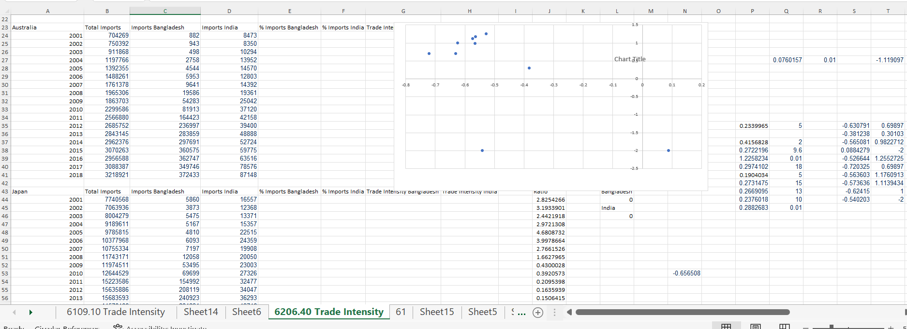
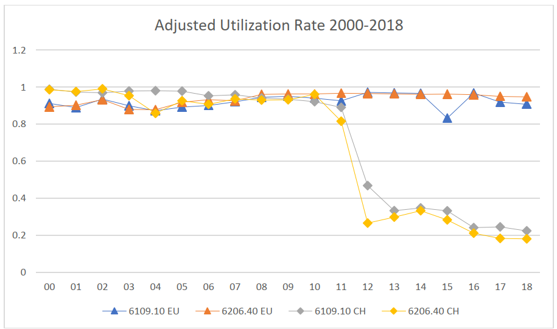
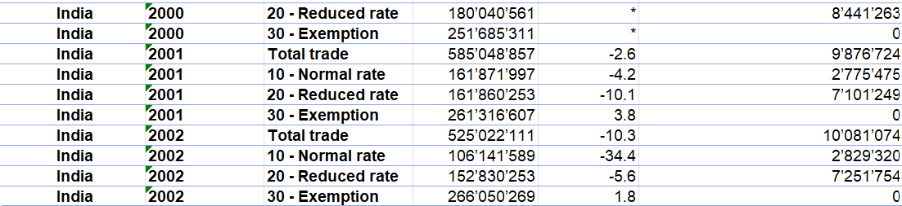
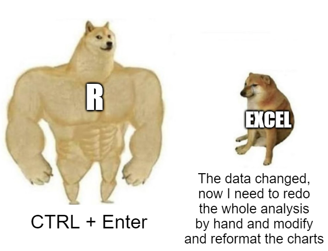
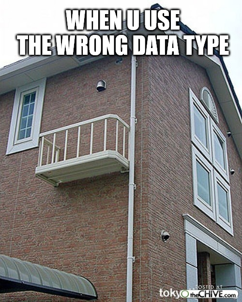
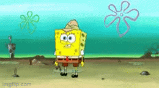
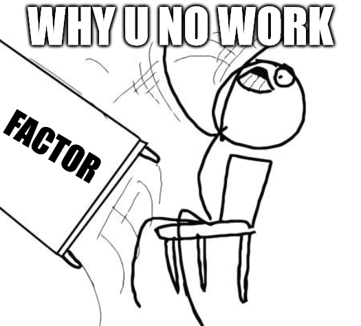
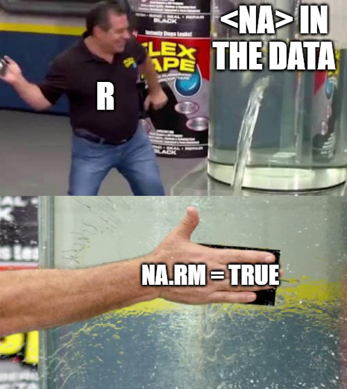
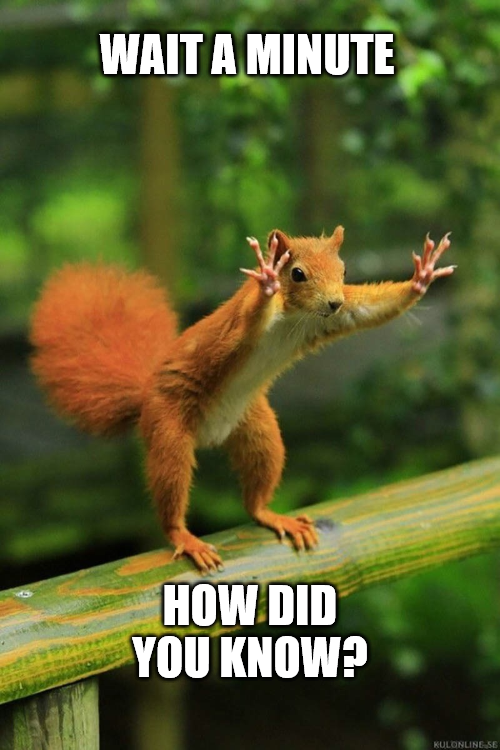
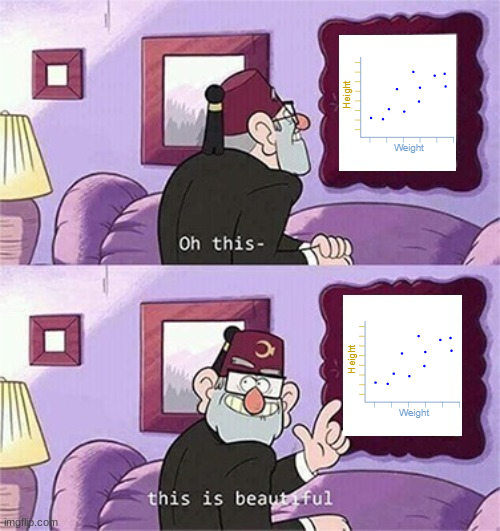

---
output:
  xaringan::moon_reader:
    css: xaringan-themer.css
    includes:
      after_body: insert-logo.html
    lib_dir: libs
    nature:
      highlightStyle: github
      highlightLines: true
      countIncrementalSlides: false
    seal: false
editor_options: 
  chunk_output_type: console
---

class: center, middle, hide-logo

```{r xaringan-themer, include=FALSE, warning=FALSE}
library(xaringanthemer)
style_mono_accent(
  base_color = "#00000e",
  header_font_google = google_font("Merriweather"),
  text_font_google   = google_font("Avenir Next"),
  code_font_google   = google_font("Fira Mono")
)
```

```{css, echo=FALSE}
pre {
background: #F8F8F8;
max-width: 100%;
overflow-x: scroll;
}
```

```{css, echo=FALSE}
.scroll-output {
height: 80%;
overflow-y: scroll;
}
```

```{r xaringan-panelset, echo=FALSE}
xaringanExtra::use_panelset()
```

```{r setup, include=FALSE}
options(htmltools.dir.version = FALSE)

# Load packages for entire presentation here

#Set Working Directory to subfolder of Website

library(tidyverse)
library(lubridate)
library(scales)
library(rstudioapi)

setwd(dirname(getActiveDocumentContext()$path))

```

# Introduction to R

## by

```{r, echo=FALSE, out.width="50%"}
knitr::include_graphics("GraphicsSlides/Logo RUG hell.png")
```

##### Authors/Presenters: Nina, Sven, Mathias
##### Last updated: _`r Sys.time()`_

---

class: hide-logo, center, middle

```{r, echo=FALSE, out.width="50%"}
knitr::include_graphics("GraphicsSlides/Logo RUG hell.png")
```

### Welcome to our first Meeting

---

### Goals for today's session

- Introduction / Welcome

- Why should you learn R

- Installing R and R Studio on your Machine 

- Getting a first overview over R Studio 

- Quick Intro into Data Types and Objects 

- Getting to know Base R commands 

- Learn a bit about Penguins

---

### Why should you learn R? 

- Excel can be extremely messy, especially when working with multiple data sheets

<br>

```{r, echo = F, out.width= "110%"}

```

---

### Why should you learn R? 

.center[
  
```{r, echo = F, out.width= "70%"}

```
]

.center[
```{r, echo = F, out.width= "120%"}

```
]
---

### Why should you learn R? 

.scroll-output[
```{r, warning = F, message = F, dpi = 300}
trade_data <- read_csv("DataSets/trade_data.csv", col_types = cols(`Period 1,2` = "d"))

out_plot <- trade_data |>
  rename(Country = `Commercial partner`, Period = `Period 1,2`, Tariff = `Kind of rate`,
         CHF_Value = `Value (CHF)`, Duties_CHF = `Amount of customs duties (CHF)`) |>
  select(Country, Period, Tariff, Duties_CHF, Product) |>
  mutate(
    Tariff = case_when(Tariff == "Total trade" ~ "Total_Trade",
                       Tariff == "10 - Normal rate" ~ "Normal_Rate",
                       Tariff == "20 - Reduced rate" ~ "Reduced_Rate",
                       Tariff == "30 - Exemption" ~ "Exemption",
                       TRUE ~ "Other")) |>
  group_by(Country, Period, Tariff, Product) |>
  summarize(Duties_CHF = max(Duties_CHF)) |>
  pivot_wider(names_from = Tariff, values_from = Duties_CHF) |>
  ungroup() |>
  replace_na(list(Normal_Rate = 0,
                  Total_Trade = 0,
                  Reduced_Rate = 0,
                  Exemption = 0)) |>
  mutate(Util_Rate = (Exemption + Reduced_Rate) / Total_Trade) |>
  filter(Country == "India") |>
  ggplot(aes(x = Period, y = Util_Rate, color = as_factor(Product)))+
  geom_point(size = 3)+
  geom_line(size = 0.8)+
  scale_y_continuous(breaks = seq(0,1.2, by = 0.2), labels = percent_format())+
  scale_x_continuous(breaks = seq(2000,2018, by = 2))+
  expand_limits(y = c(0, 1))+
  theme_minimal()+
  labs(title = "Adjusted Utilization Rate 2000 - 2018")+
  theme(plot.title  = element_text(size = 22, hjust = 0.5, face = "bold"),
        axis.title  = element_blank(),
        axis.text = element_text(size = 14),
        panel.grid.minor.x = element_blank(),
        panel.grid.major.x = element_blank(),
        legend.position = "bottom",
        legend.title = element_blank(),
        legend.text = element_text(size = 12))
```
]
---

.center[

<br>
<br>

```{r, warning=FALSE, echo = F, out.width="100%", dpi=300, fig.height=4.5}
out_plot
```
]
---

### Why should you learn R? 

.pull-left[
```{r, out.width="100%", fig.height=9, echo=FALSE, message=FALSE, warning=FALSE, dpi=300}
out_plot
```
]

.pull-right[

- Most of all: Reproducible!
- Work with Large Data Sets

--> eg. [**US Election Donations Analysis**](https://github.com/svensglinz/Data_Analysis_Project)
<br>

```{r, echo=FALSE, out.width="100%"}

```

]

---

### Shiny Apps: Host your work online for external users

<div>
<center>
<iframe src="https://svenglinz.shinyapps.io/InteractivePlot/?showcase=0" width="900px" height="610px" frameBorder="0">
</iframe>
</center>
</div>

**TBD: Error in der Shiny app**

### Basic Concepts - Data Types and Objects
=======
---

### Just shortly: Data Types and Objects

In our R environment, we can store all sorts of objects and data.
There are various objects such as *vectors*, *matrices*, *lists* and *tibbles*.

All objects are of a certain type (for example Integer, Double, Character, Logical)
and it is important to always make sure that your data is formatted as the right type.

.pull-left[
.center[
```{r, echo = F, out.width= "65%"}
  
```
]
]

.pull-right[
Example Integers and Strings

```{r, error=TRUE}
first_number <- "100"
second_number <- 200
first_number + second_number
```
]

---

### Data Types and Objects

- Logical Values can be represented by:
  - TRUE/FALSE (alternatively: T/F)

- When performing mathematical operations, TRUE = 1, and FALSE = 0:

```{r}
a <- TRUE
b <- T
c <- FALSE

sum(a,b,c)
```

---

### Data Types and Objects

- Vectors contain multiple numbers, strings, logical values etc.
- They can only contain data of **one type**, so you cannot put a number and a string into the same vector!

.pull-left[
```{r}
first_vector <- c(1,2,3,4)
second_vector <- c(5,6,7,8)
third_vector <- c("hello", 100,
                  "test", FALSE)

first_vector + second_vector
third_vector
```
]

.pull-right[

<br>

```{r, echo = F, out.width= "140%"}
  
```
]

---

### Data Types and Objects

.scroll-output[

- Usually, you will work with rectangular data in `tibbles` or `data frames`
- `tibble`: two dimensional frame made of different columns
  - each column is a distinct vector (i.e. different data types possible)

```{r}
tibble_test <- tibble(x = first_vector, 
                      y = second_vector,
                      z = third_vector)
tibble_test
```

A list is like a vector but can contain different data types:

```{r}
list_test <- list(vector = first_vector,
                  tibble = tibble_test,
                  string = first_number,
                  number = as.numeric(first_number))

list_test
```

]

---

## Working with Tibbles

.pull-left[


```{r, echo = F, out.width= "50%"}

```
]

.pull-right[
```{r}
#install.packages("palmerpenguins")
penguins <- palmerpenguins::penguins
```
]

```{r}
head(penguins, 4)
```

---

### Working with Tibbles - Simple Subsetting

You can subset every tibble as follows:

- row and column:
`tibble_name[row_index, column_index/name] `
- row only:
`tibble_name[row_index,]`
- column only:
`tibble_name[column_index/name]` OR `tibble_name[,column_index/name]`

Now Lets get the second row and third Column of the penguins data

--

```{r, eval = FALSE}
penguins[2,3]
penguins[2, "bill_length_mm"]
```
What if we want multiple rows/ columns or if we want to delete an entry?

```{r, eval=FALSE}
penguins[c(1:5, 200:202), c(2,5)]
penguins[-c(1:4),1]
```

---

### Subsetting with Logical Conditions

If we look for a specific value within our data set (column, row or both), we can 
subset the data frame by logical conditions (==, &, |, >, >= etc...)

.center[
```{r, echo=FALSE, out.width="40%"}

```
]

```{r}
head(
  penguins[penguins$sex == "male" & penguins$island == "Biscoe",] #<<
  ,2)
```

---

### Task 1: Replace all observations of island = "Dream" with "Unknown"

Tip: First filter out the column *Island* and within this column, all Values which are *Dream*.
Then: Assign a new value to these values with <-

```{r}
library(dplyr)
glimpse(penguins)
```

---

### Step 1:

Lets filter our data set and replace the results with "Unknown"

```{r, eval=FALSE}
penguins[penguins$island == "Dream", "island"] <- "Unknown"
```

--

.pull-left[
```{r, echo=FALSE, out.width="70%"}

```
]

.pull-right[
```{r, error = TRUE, echo = F}
penguins[penguins$island == "Dream", "island"] <- "Unknown"
```
]
---

### Step 2:

Lets convert the data type from factor to string

```{r}
penguins$island <- as.character(penguins$island)
```

---

### Back to Step 1: 

```{r, error = TRUE}
penguins[penguins$island == "Dream", "island"] <- "Unknown"
head(penguins[penguins$island == "Unknown",], 3)
```

--

And if needed, lets reformat back to factor 

```{r}
penguins$island <- as.factor(penguins$island)
```

---

### Task 2: How would we see the difference in body mass between female and male penguins?

```{r}
library(dplyr)
glimpse(penguins)
```

---

### Step 1: Subsetting

- Subset the data frame for one sex

```{r}
penguins[penguins$sex == "male",]
```
---

### Step 2: Get body mass

- Extract the vector you are interested in with the $ sign

```{r}
penguins[penguins$sex == "male",]$body_mass_g
```

---

### Step 3: Calculate the mean

- use the native `mean()` function to calculate the mean body mass

--

```{r, eval=FALSE}
mean(penguins[penguins$sex == "male",]$body_mass_g)
```

--

```{r, echo=FALSE}
mean(penguins[penguins$sex == "male",]$body_mass_g)
```

What is this?

.center[
```{r, echo=FALSE, out.width="40%"}

```
]

---

### Back to Step 2: Get body mass

There are `NA` in the data!

```{r}
penguins[penguins$sex == "male",]$body_mass_g
```

---

### Back to Step 3: Calculate the mean

```{r}
mean(penguins[penguins$sex == "male",]$body_mass_g,
     na.rm = T) #<<
```

.center[
```{r, echo=FALSE, out.width="40%"}

```
]

---

### Step 4: Compare male and female penguins

```{r}
tibble(
  mean_g = c(mean(penguins[penguins$sex == "male",]$body_mass_g,
                  na.rm = T),
             mean(penguins[penguins$sex == "female",]$body_mass_g,
                  na.rm = T)),
  sex = c("male",
          "female")
)
```
---
### How do we know what arguments a function such as `mean()` can take?
.pull-left[
```{r, echo=FALSE, out.width="60%"}

```
]

.pull-right[

```{r}
args(mean.default)
```

[**R-Documentation**](https://www.rdocumentation.org/packages/base/versions/3.6.2/topics/mean)

or the easier way:
```{r, eval = FALSE}
?mean()
```
]

---

### Task 3 - Calculate the mean for all numeric variables

Tip: the function **`sapply(tibble, function)`** applies the **function** to all vectors/columns in the **tibble** and returns the result as a vector (also think about `NA` again!)

```{r}
library(dplyr)
glimpse(penguins)
```

---
### Step 1:

Filter out all numeric columns and store the result as a new object

```{r}

data_male <- penguins[penguins$sex == "female", c("bill_length_mm", "bill_depth_mm", "flipper_length_mm", "body_mass_g")]

data_female <- penguins[penguins$sex == "female", c("bill_length_mm", "bill_depth_mm", "flipper_length_mm", "body_mass_g")]

```

---
### Step 2: 

Calculate the mean for all columns in the data frame with `sapply()`, store the resulting vectors and produce the tibble.

```{r}
mean_male <- sapply(data_male, mean, 
                    na.rm = T) #<<

mean_female <- sapply(
                      na.omit(data_female), #<<
                      mean)

tibble(male = mean_male, female = mean_female)

```
---

### Task 2: How many penguins live on each island?

- Also: How many islands are there?

```{r}
library(dplyr)
glimpse(penguins)
```

---

### Step 1: Do we have 1 observation per penguin?

.scroll-output[
- Look at documentation or know from data (in obvious cases like this)
- Here: counting islands will be sufficient

```{r}
penguins$island
```
]

---

### Step 2: Use `table()`

```{r}
table(penguins$island)
```

--

- Quick outlook on `tidyverse` alternative

```{r}
penguins %>%
  count(island) #<<
```

---

### Task 3: What species live on island "Biscoe"?

- Eventually: Calculate a percentage for each species on island Biscoe

### Step 1: Subset for island

```{r}
penguins[penguins$island == "Biscoe",]
```

---

### Step 2: Get species vector

```{r}
penguins[penguins$island == "Biscoe",]$species
```

---

### Step 3: Ol' reliable `table()`

```{r}
table(penguins[penguins$island == "Biscoe",]$species)
```

- Can you calculate a percentage from this?

- The answer is: No, convert to data frame first.

--> A data frame is similar to a tibble, however, sometimes the arguments the functions 
need to coerce an element of class "table" are different. 

```{r}
my_table <- table(penguins[penguins$island == "Biscoe",]$species)
as.data.frame(my_table) #<<
```
---

### Step 4: Create a percentage column

```{r}
freq_table <-
  table(penguins[penguins$island == "Biscoe",]$species)
freq_table <- as.data.frame(freq_table)

```

- Create a new column to the right dividing the observation by the sum of `Freq`

--

```{r}
freq_table$percentage <- freq_table[,"Freq"]/sum(freq_table$Freq)

freq_table
```
---

### Why did we use a Data Frame? - What about Tibbles?

Alternatively, with `as_tibble()`

```{r, eval = FALSE}
as_tibble(my_table, .name_repair = "unique")
```

If you are interested, run the following commands!

.pull-left[
```{r}
class(my_table)
head(methods(as_tibble))

```
]

.pull-right[
```{r}
methods(as.data.frame)[29:32]
```
[**Class Tibble Documentation**](https://tibble.tidyverse.org/reference/as_tibble.html)
]

---

### Outlook on `Tidyverse`: Join us in one of the next sessions

- Not only faster to calculate percentages for one island...

```{r}
penguins %>%
  filter(island == "Biscoe") %>%
  count(species) %>%
  mutate(percentage = n/sum(n))
```

---

### Outlook on `Tidyverse`: Join us in one of the next sessions

- ...but for all combinations as well.

```{r}
penguins %>%
  group_by(island) %>%
  count(species) %>%
  transmute(island, species,
            percentage = n/sum(n)) %>%
  pivot_wider(names_from = species, values_from = percentage)
```

---

### Task 4: Linear relationship between bill length and body mass

.scroll-output[

- Console output is boring to look at: Plot the linear relationship between bill length and body mass with base R

- Tip: Check out how the function `plot` works with `?plot`

```{r, eval=FALSE}
penguins[, c("body_mass_g", "bill_length_mm")]
```

```{r, echo=FALSE}
head(penguins[, c("body_mass_g", "bill_length_mm")])
```
]


---

### Step 1: Which chart type?

- for linear relationships, we can plot a regression line in a scatter plot
- independent (predictor) variable on the x-axis
- dependent (response) variable on the y-axis

.center[
```{r, echo=FALSE, out.width="45%"}

```
]

---

### Step 2: Use `plot()`

```{r, out.width="75%", fig.height=5, dpi=300}
plot(x = penguins$bill_length_mm, y = penguins$body_mass_g)
```

---

### Step 3: Add a regression line

```{r, out.width="75%", fig.height=5, dpi=300}
plot(x = penguins$bill_length_mm, y = penguins$body_mass_g)
abline(lm(penguins$body_mass_g ~ penguins$bill_length_mm),#<<
       col = "blue", lwd = 2, lty = 2)#<<
```


---

### Step 4: Your Go

- Try it again for bill_depth_mm (predictor) on the same y variable

--

```{r, out.width="75%", fig.height=4, dpi=300}
plot(x = penguins$bill_depth_mm, y = penguins$body_mass_g)
abline(lm(penguins$body_mass_g ~ penguins$bill_depth_mm),
       col = "blue", lwd = 2, lty = 2)
```

---

### Are these two different species?

```{r, out.width="75%", fig.height=4, dpi=300}
plot(x = penguins$bill_depth_mm, y = penguins$body_mass_g)
abline(lm(penguins$body_mass_g ~ penguins$bill_depth_mm),
       col = "blue", lwd = 2, lty = 2)
```

---

### Outlook on `Tidyverse`

```{r, out.width="90%", fig.height=3.5, dpi=300, warning=FALSE, message=FALSE}
penguins %>%
  ggplot(aes(x = bill_depth_mm, y = body_mass_g, colour = species)) +
  geom_point(alpha = 0.5) +
  geom_smooth(method = "lm", se = F, lty = 2)
```
---

# That's it for today!

**Some finishing words**

For further questions, feel free to reach out to us. Make sure to stay updated on our socials and via our website where all resources and dates are also published.

<br>

.center[
```{r, echo=FALSE, out.width="60%"}
knitr::include_graphics("GraphicsSlides/Logo RUG hell.png")
```

**[Website](https://rusergroup-sg.ch/) | [Instagram](https://www.instagram.com/rusergroupstgallen/?hl=en) | [Twitter](https://twitter.com/rusergroupsg)**

]

---

class: middle, inverse, hide-logo

# Thank you for attending!

```{r, echo=FALSE}
shiny::em(
  "The material provided in this presentation including any information, tools, features, content and any images incorporated in the presentation, is solely for your lawful, personal, private use. You may not modify, republish, or post anything you obtain from this presentation, including anything you download from our website, unless you first obtain our written consent. You may not engage in systematic retrieval of data or other content from this website. We request that you not create any kind of hyperlink from any other site to ours unless you first obtain our written permission.",
  style = "color:#404040")
```