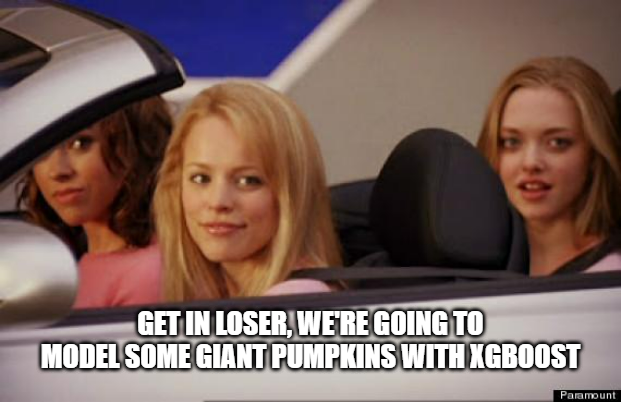
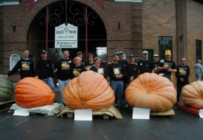

---
output:
  xaringan::moon_reader:
    css: xaringan-themer.css
    includes:
      after_body: insert-logo.html
    lib_dir: libs
    nature:
      highlightStyle: github
      highlightLines: true
      countIncrementalSlides: false
    seal: false
editor_options: 
  chunk_output_type: console
---

class: center, middle, hide-logo

```{r xaringan-themer, include=FALSE, warning=FALSE}
library(xaringanthemer)
style_mono_accent(
  base_color = "#00000e",
  header_font_google = google_font("Merriweather"),
  text_font_google   = google_font("Avenir Next"),
  code_font_google   = google_font("Fira Mono")
)
```

```{css, echo=FALSE}
pre {
  background: #F8F8F8;
  max-width: 100%;
  overflow-x: scroll;
}
```

```{css, echo=FALSE}
.scroll-output {
  height: 80%;
  overflow-y: scroll;
}
```

```{r xaringan-panelset, echo=FALSE}
xaringanExtra::use_panelset()
```

```{r setup, include=FALSE}
options(htmltools.dir.version = FALSE)

setwd(dirname(rstudioapi::getActiveDocumentContext()[[2]]))

library(tidyverse)
library(tidymodels)
```

# First Machine Learning Workshop

## by

```{r, echo=FALSE, out.width="50%"}
knitr::include_graphics("GraphicsSlides/Logo RUG hell.png")
```

##### Author/Presenter: Ruben Ernst/Mathias Steilen
##### Last updated: _`r Sys.time()`_

---

### Today's Mission

<br>
<br>

.center[
```{r, echo=FALSE, out.width="60%"}

```
]

Courtesy of the TidyTuesday project - Check it out!

---

# Background

> The Great Pumpkin Commonwealth's (GPC) mission cultivates the hobby of growing giant pumpkins throughout the world by establishing standards and regulations that ensure quality of fruit, fairness of competition, recognition of achievement, fellowship and education for all participating growers and weigh-off sites.

_[Link to Website](https://gpc1.org/)_

.center[
```{r, echo=FALSE, out.width="50%"}

```
]

---

# Let's look at the files

.panelset[

.panel[.panel-name[training]

```{r}
training <- read_csv("./Data/training.csv")
```

This file will be used for training/fitting your model.

]

.panel[.panel-name[testing]

```{r}
holdout <- read_csv("./Data/holdout.csv")
```

This file will be used to make predictions on. There is no target variable in here, so there won't be data leakage during training. However, before submitting your predictions, please follow the sample submission format.

]

.panel[.panel-name[sample_submission]

```{r}
sample_submission <- read_csv("./Data/sample_submission.csv")
```

**Important**: Your submission to our email address must adhere to this format (CSV file).

]

]

---

# Our Basic Example

**Disclaimer**

--

.pull-left[

Some of you might feel like this:

.center[
```{r, echo=FALSE, out.width="75%"}

```
]

]

--

.pull-right[

And some of you might feel like this:

```{r, echo=FALSE, out.width="100%"}

```

]

--

The learning curve is always steep when looking at it from the bottom. Use the time later to ask your more experienced peers (or us) questions.

---

#### Our Basic Example: The ol' reliable$

Make splits from the training first:

```{r}
dt_split <- initial_split(training)
dt_train <- training(dt_split)
dt_test <- testing(dt_split)

folds <- vfold_cv(dt_train, v = 5) # resampling for tuning
```

```{r}
dt_split
```

---

#### Our Basic Example: The ol' reliable

Let's fit a basic, linear regression with a penalty.

```{r}
lin_spec <- linear_reg(mixture = tune(), penalty = tune()) %>%
  set_mode("regression") %>%
  set_engine("glmnet")
```

```{r}
lin_rec <- recipe(weight_kg ~ year + place + ott + est_weight + country,
                  data = training) %>%
  step_impute_mean(all_numeric_predictors()) %>%
  step_novel(all_nominal_predictors()) %>% 
  step_unknown(all_nominal_predictors(), new_level = "not specified") %>%    
  step_other(country, threshold = 0.03) %>%
  step_dummy(all_nominal_predictors(), one_hot = T) %>% 
  step_rm(country_other)
```

---

#### Our Basic Example: The ol' reliable

```{r}
lin_rec %>% prep() %>% juice()
```

---

#### Our Basic Example: The ol' reliable

.scroll-output[

```{r}
lin_wf <- workflow() %>%
  add_recipe(lin_rec) %>%
  add_model(lin_spec)

lin_wf
```

]

---

#### Our Basic Example: The ol' reliable

Let's tune the penalty:

```{r}
lin_tune_results <- tune_grid(
  lin_wf,
  resamples = folds,
  grid = grid_regular(penalty(),
                      mixture(),
                      levels = 10)
)
```

---

#### Our Basic Example: The ol' reliable

.scroll-output[

Let's look at the results:

```{r}
lin_tune_results %>% 
  show_best(metric = "rsq")
```

]
---

#### Our Basic Example: The ol' reliable

Let's finalise the model with the best parameters from tuning:

```{r}
lin_fit <- lin_wf %>% 
  finalize_workflow(select_best(lin_tune_results, metric = "rsq")) %>% 
  fit(dt_train)
```

Fitting onto the training split.

---

#### Our Basic Example: The ol' reliable

```{r}
lin_fit %>% 
  predict(dt_test)
```

---

#### Our Basic Example: The ol' reliable

```{r}
lin_fit %>% 
  augment(dt_test) %>% 
  rsq(truth = weight_kg, estimate = .pred)
```

---

#### Our Basic Example: The ol' reliable

Happy with that? Fit it on the entire training data provided and then make predictions for your final submission:

```{r}
final_model <- lin_wf %>% 
  finalize_workflow(select_best(lin_tune_results, metric = "rsq")) %>% 
  fit(training) #<<
```

---

#### Our Basic Example: The ol' reliable

.scroll-output[

Make predictions and save the results as _.csv_. Then submit your predictions to us and we will score them. You can submit as often as you like, and we'll give you information about your performance on the holdout, as we have the target values.

```{r}
final_model %>% 
  augment(holdout) %>% 
  select(id, .pred) %>% 
  rename(weight_kg = .pred)
```

]

---

#### Our Basic Example: The ol' reliable

.scroll-output[
```{r, dpi=300, out.width="100%", fig.height=4}
final_model %>% 
  augment(read_csv("./Data/holdout_with_target.csv", show_col_types = F)) %>% 
  ggplot(aes(weight_kg, .pred)) +
  geom_point(alpha = 0.2) +
  geom_abline(lty = "dashed", colour = "red")
```
]

---

### You won't have the target variable on the holdout data set for two reasons

--

.pull-left[

.center[

**Reason 1:**

<br>

```{r, echo=FALSE, out.width="100%"}

```
]

]

--

.pull-right[

.center[

**Reason 2:**

<br>

```{r, echo=FALSE, out.width="60%"}

```
]

]

There's something to win here - so play fair.

---

### Off you go

Have a look at our example for dealing with splits and hyperparameter tuning in the Tidymodels tutoring session. We'll be here for you to ask questions, once you get to it. Copying and pasting the code in the slides is **allowed**!

Spend as long as you need modelling.

#### 🕒 20:00

---

# That's it for today!

After our session: Watch videos from Julia Silge, Andrew Couch and David Robinson. Most importantly, have fun while learning.   

For further questions, feel free to reach out to us. Make sure to stay updated on our socials and via our website where all resources and dates are also published.

<br>

.center[
```{r, echo=FALSE, out.width="60%"}
knitr::include_graphics("GraphicsSlides/Logo RUG hell.png")
```

**[Website](https://rusergroup-sg.ch/) | [Instagram](https://www.instagram.com/rusergroupstgallen/?hl=en) | [Twitter](https://twitter.com/rusergroupsg)**

]

---

class: middle, inverse, hide-logo

# Thank you for attending!

```{r, echo=FALSE}
shiny::em(
  "The material provided in this presentation including any information, tools, features, content and any images incorporated in the presentation, is solely for your lawful, personal, private use. You may not modify, republish, or post anything you obtain from this presentation, including anything you download from our website, unless you first obtain our written consent. You may not engage in systematic retrieval of data or other content from this website. We request that you not create any kind of hyperlink from any other site to ours unless you first obtain our written permission.",
  style = "color:#404040")
```