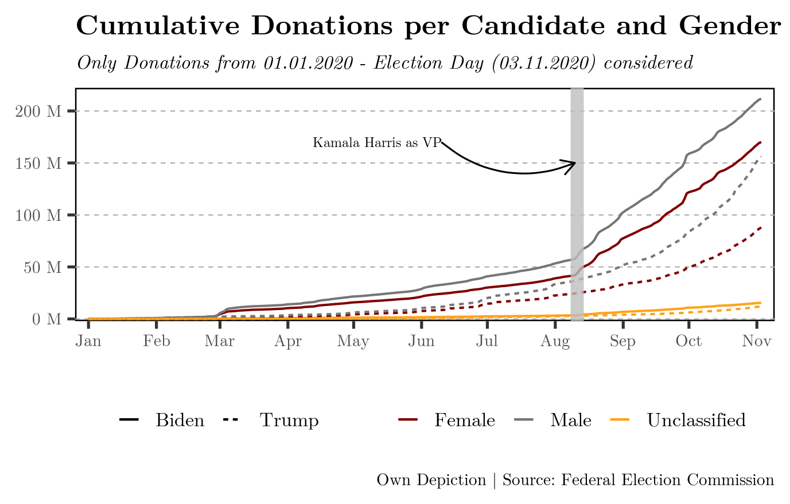

```{r setup, include=FALSE}
knitr::opts_chunk$set(echo = TRUE, eval = TRUE, dev = "cairo_pdf")
setwd(dirname(rstudioapi::getActiveDocumentContext()$path))
```

## Task Description

The US Election campaign of 2020 between Joe Biden and Donald Trump was a hotly debated topic. Have you ever wondered who donated to the campaign of those two and if so, how much was donated but also which genders donated? The fact that women tend to support Democrats more than Republicans is widely known, but is this also reflected in donation behavior to the presidential candidates? And did the fact that Trump's comments and attitude towards women were not always exactly flattering play a role in how many men and women donated in the election? What about Biden's announcement in early August 2020 that he would pick Kamala Harris as a Vice President - Did this boost his donations from women? 

The following exercise will allow you to gain an insight into these questions with real data coming directly from the US Government. 

## The Data 

By US law, everyone who cumulatively donates more than 200 USD per election cycle must be reported to a database which is publicly available. We thus have access to all donations over 200 Dollars. Some donations which are less than 200 USD are also reported, but we have to assume that the majority of those donations is not captured in our data set. (Thus, when drawing conclusions, we have to be aware that some donations cannot be analyzed, but the sample we have is extremely large and covers the majority of donations). 

The original data set is available at the [Federal Election Commission](https://www.fec.gov/data/browse-data/?tab=bulk-data) and is over 16 GB large. We have already done some pre-cleaning for you, which leaves us with a file of under 400 MB which contains all relevant information for this exercise.  

 \faFolderOpen Download the pre-cleaned donation dataset from [here](https://1drv.ms/u/s!AoQRAZtdS9u4iZ8hDK5yHdj-95PAwg?e=EremqD) 

```{r, message=FALSE, warning=FALSE} 
 library(tidyverse) 
 donations <- read_csv("donations.csv") 
 glimpse(donations) 
``` 

 As you can see, the data file contains the name of the donor, the donation date, the amount donated and other information such as employment - and residential information. However, unfortunately, as it is often the case in real life, we miss some crucial data, namely the gender of the donors. This is not reported by the FEC. 

 So what do we do?  

If you dig around for long enough, you will find that the [Social Security Administration](https://www.ssa.gov/oact/babynames/limits.html) in the US publishes a text file every year which contains for all babies born in the United States in a given year the names, their gender as well as the number of occurrences. This will help us in assigning a gender to each name in the donations data set.  

\faFolderOpen Download the folder containing all text files from [here](https://1drv.ms/u/s!AoQRAZtdS9u4iZ1kIze35hAXaKOpGQ?e=3PcrFs) 

## Processing the Data 

First, lets read in all those baby names. As the files are separated by year, you need to find a way to combine all the files to one data frame. 

Below, you find one possible way to do this. 

```{r, message = FALSE} 
 # get the pathname of all files in the folder 
 filenames <- list.files("names") 

 #create empty data frame 
 baby_names <- data.frame() 

 #loop over all files, read them and paste to names df 
 for (i in filenames){ 
   temp <- read_delim(paste("names/", i, sep = ""), delim = ",", col_names = FALSE) 
   baby_names <- bind_rows(baby_names, temp) 
 } 

 # add column names to the data frame 
 colnames(baby_names) <- c("NAME", "GENDER", "COUNT") 
``` 

If you skim through the data, you can see that some names are used for both boys and girls. So how do we assign a definitive gender to each name? 
What we could do is group all observations by gender and first name, and sum up over the occurrences. After some modifications, we can calculate the % of times each name is used for males and females and establish the following rule:  

- If occurrences Female / total occurences $\geq$ 0.75 $\rightarrow$ Female
- If occurences Male / total occurences $\geq$ 0.75 $\rightarrow$ Male
- else $\rightarrow$ NA (we cannot determine the gender with high enough accuracy)

\faLightbulbO \hspace{.15cm} Use commands such as `summarize()`, `group_by()` and possibly `pivot_wider()`  

Your output after performing the calculations may look something like the following:  

```{r, echo=FALSE, message=FALSE, warning=FALSE} 
 baby_names |>  
   group_by(NAME, GENDER) |>  
   summarize(COUNT = sum(COUNT)) |>  
   pivot_wider(names_from = GENDER, values_from = COUNT) |>  
   replace_na(list(F = 0, M = 0)) |>  
   mutate(RATIO_M = M / (M+F)) |>  
   mutate(GENDER = case_when(RATIO_M >= .75 ~ "M", 
                             RATIO_M < .25 ~ "F", 
                             TRUE ~ "NA"))|>  
   filter(NAME %in% c("Aari", "Aero", "Aspen", "Athena")) |>  
   ungroup() 
``` 

In a second step, we need to join the first names of the *baby_names* data frame onto the first names of the *donations* data set. 

**Problem:** 

The Donation Data set contains the first name and last name together. Further, all names are in upper case. 

**Solution:** 

1. transform baby names to upper case or donation names to lower case
2. Split the names in the *donations* data frame into last and first name (at the occurrence of the first comma)

\faLightbulbO \hspace{.15cm} In order to split a string, you can use the `str_split` command. 

```{r} 
#extract name vector 
donor_names <- donations$NAME 
#split name vector by comma (separates first and last name) 
first_name <- str_split(donor_names, pattern = ",", simplify = TRUE)[,2] 
``` 

\faExclamationTriangle \hspace{.15cm}  **Attention:** \hspace{.15cm} \faExclamationTriangle  

As you may suspect, the names are sometimes messed up and you will need to find a solution to handle some common errors, if you want to maximize the matches between your first names in the *donations* data set and the *baby_names* data set 

Lets have a look at some names which may cause you a headache:  

- HARLAN JR., ANDREW D. 
- GUSTAFSON, JOHN & CONNIE 
- MEEK, CHARLES  RONALD (RON) 

After splitting these at the first comma and selecting the second part, we are left with: 

- ANDREW D.
- JOHN & CONNIE
- CHARLES RONALD (RON)

Our goal should be to get one unique first name (to maximize the likelihood to match it with a name of the *baby_names* data set) 

$\rightarrow$ Your task is to think of ways how to do this 

\faLightbulbO \hspace{.15cm} if you have multiple names, you could as a rule select the longest string as the "proper name". (eg. First Name = CHARLES RONALD \rightarrow First Name = CHARLES) 

To see how you can use the power of *regular expressions* to achieve your task, check out the [regex cheatsheet](https://evoldyn.gitlab.io/evomics-2018/ref-sheets/R_strings.pdf) 

Once you have successfully cleaned the names, join the first names vector back onto your *baby_names* dataframe and finally join the dataframe onto the *donations* dataframe (join by first name). 

## Calculations and Plotting 

Now, you are ready for doing some plots and calculations! 
For example, you could calculate and/or visualize the following: 

- How many female and male donors were there for Trump and Biden? (\faExclamationTriangle \hspace{.15cm} some people may have donated multiple times. Think of a way to group these people together with the information you have in the data frame) 
- Visualize the cumulative donations / monthly donations by Candidate and check, if the appointment of Kamala Harris in August changed the Donation Pattern to Biden 
- How much money was donated by each Gender to Biden and Trump? (in absolute & relative terms) 
- What employment did the donors have? Is there one group that stands out? Is there a difference between male and female and between those who donated to Trump and Biden? 

## Sample Plots 

{width=95%}

Feel free to ask questions in our Q&A chat and hand in your charts and code. We are looking forward to your submissions!
