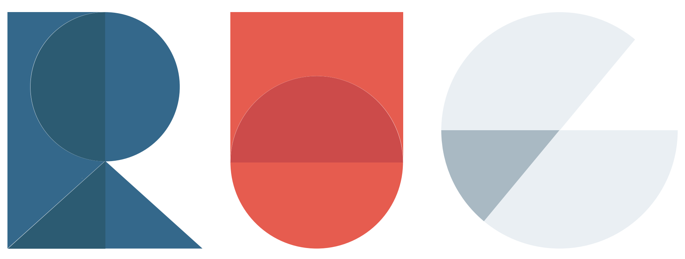
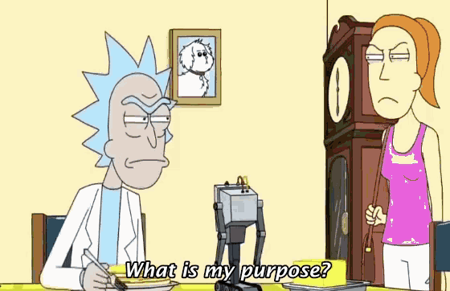
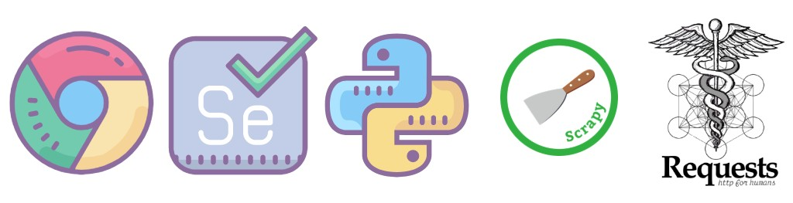
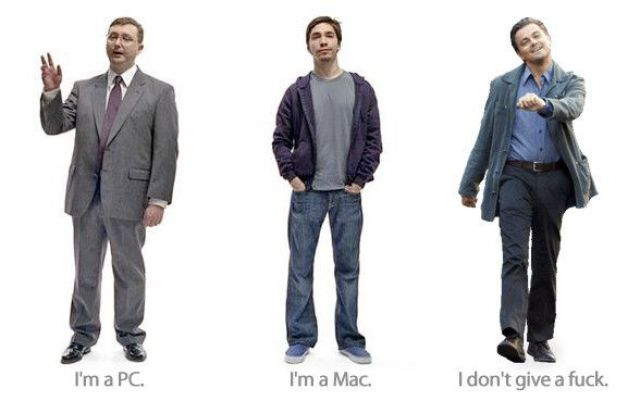
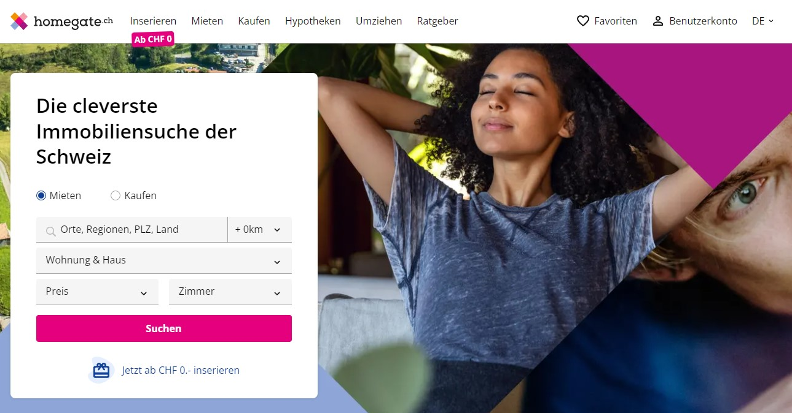
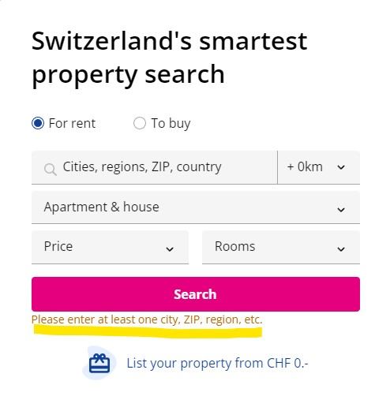
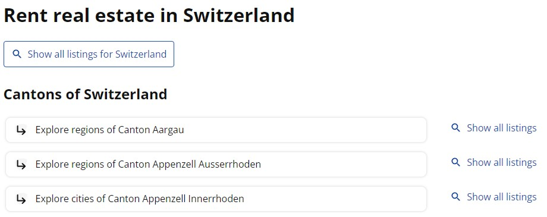
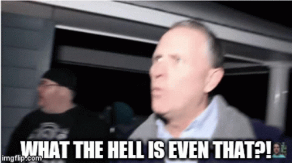
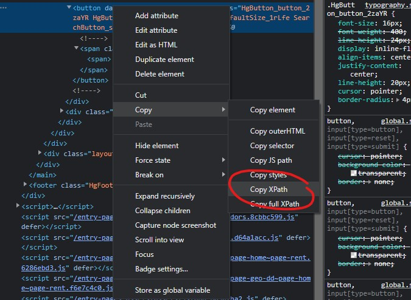

---
output:
  xaringan::moon_reader:
    css: xaringan-themer.css
    includes:
      after_body: insert-logo.html
    lib_dir: libs
    nature:
      highlightStyle: github
      highlightLines: true
      countIncrementalSlides: false
    seal: false
editor_options: 
  chunk_output_type: console
---

class: center, middle, hide-logo

```{r xaringan-themer, include=FALSE, warning=FALSE}
library(xaringanthemer)
style_mono_accent(
  base_color = "#00000e",
  header_font_google = google_font("Merriweather"),
  text_font_google   = google_font("Avenir Next"),
  code_font_google   = google_font("Fira Mono")
)
```

```{css, echo=FALSE}
pre {
background: #F8F8F8;
max-width: 100%;
overflow-x: scroll;
}
```

```{css, echo=FALSE}
.scroll-output {
height: 80%;
overflow-y: scroll;
}
```

```{r xaringan-panelset, echo=FALSE}
xaringanExtra::use_panelset()
```

```{r setup, include=FALSE}
options(htmltools.dir.version = FALSE)

# Load packages for entire presentation here
library(tidyverse)
library(RSelenium)
library(splitstackshape)
```

# Web Scraping with Selenium

## by

```{r, echo=FALSE, out.width="50%"}

```

##### Author/Presenter: Ruben
##### Last updated: _`r Sys.time()`_

---

# Goals for today's session

Obvious ones:
- Learn about commonly used approaches to web scraping
- Know how to scrape websites using Selenium with R

Less obvious ones:
- Learn how to go about scraping "complex" websites
- Get a more intuitive understanding of the make-up of websites

---
# The basic idea behind web scraping

If interesting data is available openly on websites, why not just take it?

<br>

.center[
```{r, echo=FALSE, out.width="50%"}
knitr::include_graphics("GraphicsSlides/free-real-estate.gif")
```
]

---

# The basic idea behind web scraping

Just a couple of possible roadblocks:
- It's spread across a lot of sites
- It's unstructured

And most importantly: why do something by hand when you can write code for hours to do it for you?

--

.center[
```{r, echo=FALSE, out.width="40%"}

```
]

---

# Different approaches for webscraping

You might have heard of these:
- BeautifulSoup
- Requests
- Scrapy
- Selenium

As you might have guessed, today we're using Selenium!

.center[
```{r, echo=FALSE, out.width="80%"}

```
]

---

# Why use Selenium?

.pull-left[
##BeautifulSoup and Requests
are mainly used to
- GET web pages and
- support you in the extraction of data from the DOM (you don't need to fully understand this right now)

--> "static" web scraping
]

.pull-right[
##Selenium
"drives" a browser and can therefore be used to scrape more complex websites with
- buttons to press
- inputs to fill out
- errors and timeouts

--> "dynamic" web scraping
]

---

# The setup

First we need to install some packages:
```{r, echo=TRUE, eval=FALSE}
library(RSelenium)
library(xml2)
```
--

And choose our desired browser to drive (I like Chrome):

.center[
```{r, echo=FALSE, out.width="50%"}

```
]

---

# Download chromedriver

Chromedriver is a development tool. You can download it here:
https://chromedriver.chromium.org/downloads

.pull-left[
On Windows put the file in<br>
`C:\Windows\`
]

.pull-right[
On MacOS put the file in<br>
`/usr/bin/` <br>
(you get there by pressing `cmd + G` and pasting the path above)
]

.center[
```{r, echo=FALSE, out.width="60%"}

```
]

---

# Today's target: homegate.ch

.center[
```{r, echo=FALSE, out.width="100%"}

```
]

---

# Some considerations before we start

.pull-left[
- Why not just click the "search" button to have all the listings
- We have to enter a region

-> way too annoying to do manually
]


.pull-right[
```{r, echo=FALSE, out.width="100%"}

```
]

---

# Some considerations before we start

Having a look around the page reveals that we can nonetheless access all the listings:

.center[
```{r, echo=FALSE, out.width="80%"}

```
]

We can go by canton and make Selenium click all the buttons for us

---

# Let's fire up that robo-browser

```{r, echo=TRUE, eval=FALSE}
chromeDr <- rsDriver(browser = "chrome", port = 4569L, chromever = "105.0.5195.52",
                       extraCapabilities = list(chromeOptions = list(args = c('--disable-gpu', '--window-size=1280,800'),
                                                                     prefs = list(
                                                                       "profile.default_content_settings.popups" = 0L,
                                                                       "download.prompt_for_download" = FALSE,
                                                                       "directory_upgrade" = TRUE
                                                                     ))))

remDr <- chromeDr[["client"]]
```

The extra options are used ensure that:
- We don't run into graphics driver issues
- We suppress popups
- We have adequate permissions

---

# Opening a webpage

From here it's like regular web browsing - except controlled by your code

```{r, echo=TRUE, eval=FALSE}
remDr$navigate("https://www.homegate.ch/mieten/immobilien/land-schweiz")
```

Interacting with the filters and buttons is just as easy:

```{r, echo=TRUE, eval=FALSE}
e <- remDr$findElement(value = '//*[@id="app"]/main/div/div/div[2]/div[1]/div/div[2]/div/div[1]/div[2]/a/span')
e$clickElement()
```

---

# How to find stuff on a webpage

We find elements (such as buttons and the data we want) via XPATHs (among others)

Like you've seen previously:<br>
```{r, echo=TRUE, eval=FALSE}
'//*[@id="app"]/main/div/div/div[2]/...'
```

.center[
```{r, echo=FALSE, out.width="50%"}

```
]

---

# The DOM

Webpages are built in the hypertext markup language (HTML):<br>

```{html, echo=TRUE, eval=FALSE}
<!DOCTYPE html>
  <html>
    <body>
      <h1>My First Heading</h1>
      <p>My first paragraph.</p>
    </body>
  </html>
```
    
XPATHs are just a way to express the "path" of any element in this structure

--

In this case: to get the heading element:<br>
```{r, echo=TRUE, eval=FALSE}
'//body/h1'
```

---

# Extracting the actual data

Depending on the element, we want different attributes of the elements:
- text
- href (a link)
- value (with inputs)

or even metadata:
- whether the element exists
- how many of the same elements exist
- the child elements

---

# Example

```{html, echo=TRUE, eval=FALSE}
  <body>
    <div>
      <a href='https://example.com'>Link 1</a>
      <a href='https://example.com'>Link 2</a>
      <a href='https://example.com'>Link 3</a>
    </div>
  </body>
```

--

```{r, echo=TRUE, eval=FALSE}
'//body/div/a[2]'
```

gives us:
.pull-left[
- text: <mark>"Link 2"</mark>
- href: <mark>"https://example.com"</mark>
- value: <mark>None</mark>
]

.pull-right[
- element exists: <mark>yes</mark>
- how many of the same elements exist: <mark>3</mark>
- the child elements: <mark>None</mark>
]

---

# Supertrick: Getting XPATHS easily

In your browser, open the developer console:<br>
`F12` or `cmd + opt + i`

Find the element with the picker tool (top left) and copy its XPATH

.center[
```{r, echo=FALSE, out.width="50%"}

```
]

---

### Task 1: Get the text of the pink button on homegate

**Tip:** Start by finding the element and then extract its *text* attribute as follows:

```{r, echo=TRUE, eval=FALSE}
remDr$findElement(value = '//some XPATH')$getElementText()
```

--

```{r, echo=TRUE, eval=FALSE}
remDr$findElement(value = '//*[@id="app"]/main/div/div[2]/div/div/div[5]/button')$getElementText()
```

```{r, echo=TRUE, eval=FALSE}
[[1]]
[1] "Suchen"
```

---

# Finding multiple elements

Often it is useful to find multiple elements at once.

.center[
```{r, echo=FALSE, out.width="50%"}

```
]

Here we could extract the links to all cantons and save them to go through later.

```{r, echo=TRUE, eval=FALSE}
e <- remDr$findElements(value = "//*/div[contains(@class, 'GeoDrillDownSRPLink')]/a")

canton_links <- unlist(lapply(e, function(x){x$getElementAttribute("href")}))[2:27]
```


---

# So let's recap

We wanted:

- Title page
- Table of contents
- Table of figures
- Page numbering
- Citations
- References
- ...

And most importantly: No more manual copying and pasting.

---

# That's it for today!

**Some finishing words**

For further questions, feel free to reach out to us. Make sure to stay updated on our socials and via our website where all resources and dates are also published.

<br>

.center[
```{r, echo=FALSE, out.width="60%"}

```

**[Website](https://rusergroup-sg.ch/) | [Instagram](https://www.instagram.com/rusergroupstgallen/?hl=en) | [Twitter](https://twitter.com/rusergroupsg)**

]

---

class: middle, inverse, hide-logo

# Thank you for attending!

```{r, echo=FALSE}
shiny::em(
  "The material provided in this presentation including any information, tools, features, content and any images incorporated in the presentation, is solely for your lawful, personal, private use. You may not modify, republish, or post anything you obtain from this presentation, including anything you download from our website, unless you first obtain our written consent. You may not engage in systematic retrieval of data or other content from this website. We request that you not create any kind of hyperlink from any other site to ours unless you first obtain our written permission.",
  style = "color:#404040")
```