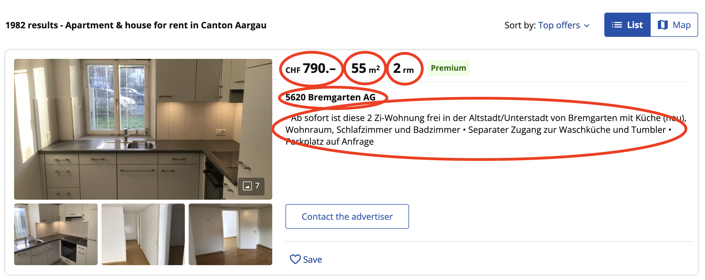
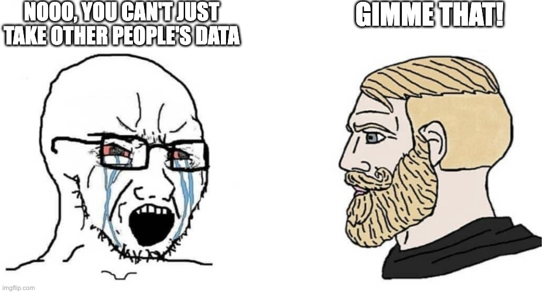
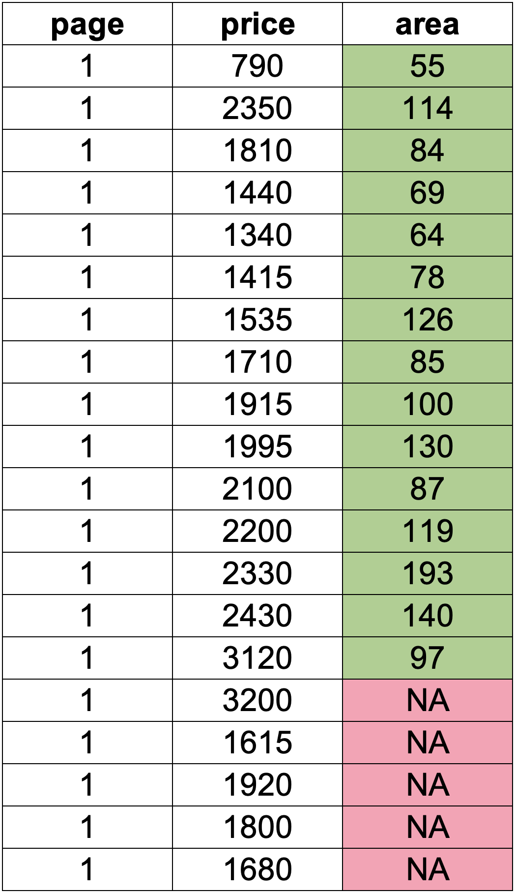
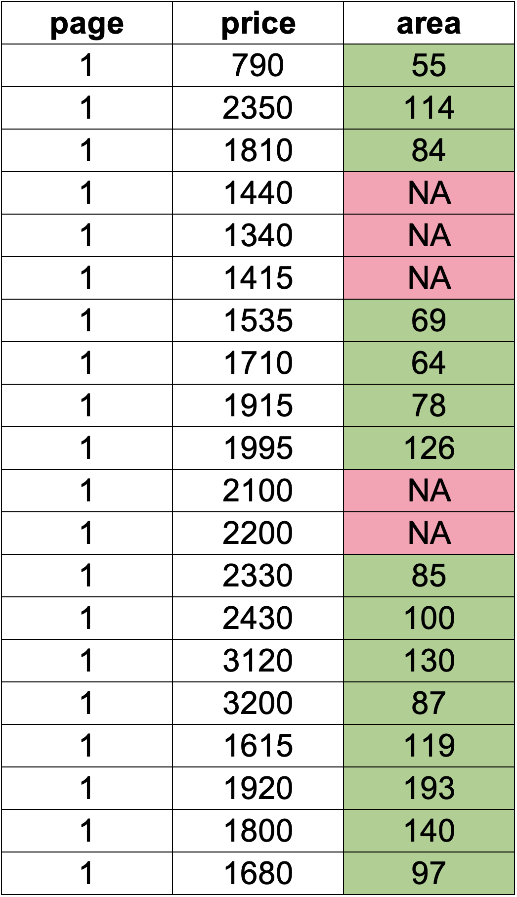

---
output:
  xaringan::moon_reader:
    css: xaringan-themer.css
    includes:
      after_body: insert-logo.html
    lib_dir: libs
    nature:
      highlightStyle: github
      highlightLines: true
      countIncrementalSlides: false
    seal: false
editor_options: 
  chunk_output_type: console
---

class: center, middle, hide-logo

```{r xaringan-themer, include=FALSE, warning=FALSE}
library(xaringanthemer)
style_mono_accent(
  base_color = "#00000e",
  header_font_google = google_font("Merriweather"),
  text_font_google   = google_font("Avenir Next"),
  code_font_google   = google_font("Fira Mono")
)
```

```{css, echo=FALSE}
pre {
background: #F8F8F8;
max-width: 100%;
overflow-x: scroll;
}
```

```{css, echo=FALSE}
.scroll-output {
height: 80%;
overflow-y: scroll;
}
```

```{r xaringan-panelset, echo=FALSE}
xaringanExtra::use_panelset()
```

```{r setup, include=FALSE}
options(htmltools.dir.version = FALSE)

# Load packages for entire presentation here
library(tidyverse)
library(RSelenium)
library(splitstackshape)
```

# Web Scraping with Selenium

## by

```{r, echo=FALSE, out.width="50%"}
knitr::include_graphics("GraphicsSlides/Logo RUG hell.png")
```

##### Author/Presenter: Ruben
##### Last updated: _`r Sys.time()`_

---

## Goals for today's session

Obvious ones:
- Learn about commonly used approaches to web scraping
- Know how to scrape websites using Selenium with R

Less obvious ones:
- Learn how to go about scraping "complex" websites
- Get a more intuitive understanding of the make-up of websites

---
## The basic idea behind web scraping

If interesting data is available openly on websites, why not just take it?

<br>

.center[
```{r, echo=FALSE, out.width="50%"}
knitr::include_graphics("GraphicsSlides/free-real-estate.gif")
```
]

---

## The basic idea behind web scraping

Just a couple of possible roadblocks:
- It's spread across a lot of sites
- It's unstructured

And most importantly: why do something by hand when you can write code for hours to do it for you?

.center[
```{r, echo=FALSE, out.width="35%"}

```
]

---

## Different approaches for webscraping

You might have heard of these:
- BeautifulSoup
- Requests
- Scrapy
- Selenium

As you might have guessed, today we're using Selenium!

.center[
```{r, echo=FALSE, out.width="80%"}
knitr::include_graphics("GraphicsSlides/scraping_packages.png")
```
]

---

## Why use Selenium?

.pull-left[
### BeautifulSoup and Requests
are mainly used to
- GET web pages and
- support you in the extraction of data from the DOM (you don't need to fully understand this right now)

--> "static" web scraping
]

.pull-right[
### Selenium
"drives" a browser and can therefore be used to scrape more complex websites with
- buttons to press
- inputs to fill out
- errors and timeouts

--> "dynamic" web scraping
]

---

## The setup

First we need to install the RSelenium package (and tidyverse of course):
```{r, echo=TRUE, eval=FALSE}
library(RSelenium)
library(tidyverse)
```
--

And choose our desired browser to drive (I like Chrome):

.center[
```{r, echo=FALSE, out.width="50%"}
knitr::include_graphics("GraphicsSlides/chrome.jpg")
```
]

---

## Download chromedriver

Chromedriver is a development tool. You can download it here:
https://chromedriver.chromium.org/downloads

.pull-left[
On Windows put the file in<br>
`C:\Windows\`
]

.pull-right[
On MacOS put the file in<br>
`/usr/bin/` <br>
(you get there by pressing `cmd + G` and pasting the path above)
]

.center[
```{r, echo=FALSE, out.width="60%"}
knitr::include_graphics("GraphicsSlides/im_a_mac.jpg")
```
]

---

## Today's target: homegate.ch

.center[
```{r, echo=FALSE, out.width="100%"}
knitr::include_graphics("GraphicsSlides/screenshot_homegate.jpg")
```
]

---

## Some considerations before we start

.pull-left[
- Why not just click the "search" button to have all the listings
- We have to enter a region

-> way too annoying to do manually
]


.pull-right[
```{r, echo=FALSE, out.width="100%"}
knitr::include_graphics("GraphicsSlides/screenshot_filters.jpg")
```
]

---

## Some considerations before we start

Having a look around the page reveals that we can nonetheless access all the listings:

.center[
```{r, echo=FALSE, out.width="80%"}
knitr::include_graphics("GraphicsSlides/screenshot_for_rent.jpg")
```
]

We can go by canton and make Selenium click all the buttons for us

---

## Let's fire up that robo-browser

```{r, echo=TRUE, eval=FALSE}
chromeDr <- rsDriver(browser = "chrome", port = 4569L, chromever = "105.0.5195.52",
                     extraCapabilities = list(chromeOptions = list(args = c('--disable-gpu', '--window-size=1280,800'),
                                                                   prefs = list(
                                                                     "profile.default_content_settings.popups" = 0L,
                                                                     "download.prompt_for_download" = FALSE,
                                                                     "directory_upgrade" = TRUE
                                                                   ))))

remDr <- chromeDr[["client"]]
```

The extra options are used ensure that:
- We don't run into graphics driver issues
- We suppress popups
- We have adequate permissions

---

## Opening a webpage

From here it's like regular web browsing - except controlled by your code

```{r, echo=TRUE, eval=FALSE}
remDr$navigate("https://www.homegate.ch/mieten/immobilien/land-schweiz")
```

Interacting with the filters and buttons is just as easy:

```{r, echo=TRUE, eval=FALSE}
e <- remDr$findElement(value = '//*[@id="app"]/main/div/div/div[2]/div[1]/div/div[2]/div/div[1]/div[2]/a/span')
e$clickElement()
```

---

## How to find stuff on a webpage

We find elements (such as buttons and the data we want) via XPATHs (among others)

Like you've seen previously:<br>
```{r, echo=TRUE, eval=FALSE}
'//*[@id="app"]/main/div/div/div[2]/...'
```

.center[
```{r, echo=FALSE, out.width="50%"}
knitr::include_graphics("GraphicsSlides/what-the.gif")
```
]

---

## The DOM

Webpages are built in the hypertext markup language (HTML):<br>

```{html, echo=TRUE, eval=FALSE}
<!DOCTYPE html>
  <html>
    <body>
      <h1>My First Heading</h1>
      <p>My first paragraph.</p>
    </body>
  </html>
  ```

XPATHs are just a way to express the "path" of any element in this structure

--

In this case: to get the heading element:<br>
```{r, echo=TRUE, eval=FALSE}
'//body/h1'
```

---

## Extracting the actual data

Depending on the element, we want different attributes of the elements:
- text
- href (a link)
- value (with inputs)

or even metadata:
- whether the element exists
- how many of the same elements exist
- the child elements

---

## Example

```{html, echo=TRUE, eval=FALSE}
<body>
  <div>
    <a href='https://example.com'>Link 1</a>
    <a href='https://example.com'>Link 2</a>
    <a href='https://example.com'>Link 3</a>
  </div>
</body>
```
  
--
  
```{r, echo=TRUE, eval=FALSE}
'//body/div/a[2]'
```

gives us:
.pull-left[
- text: <mark>"Link 2"</mark>
- href: <mark>"https://example.com"</mark>
- value: <mark>None</mark>
]

.pull-right[
- element exists: <mark>yes</mark>
- how many of the same elements exist: <mark>3</mark>
- the child elements: <mark>None</mark>
]

---

## Supertrick: Getting XPATHS easily

In your browser, open the developer console:<br>
`F12` or `cmd + opt + i`

Find the element with the picker tool (top left) and copy its XPATH

.center[
```{r, echo=FALSE, out.width="50%"}
knitr::include_graphics("GraphicsSlides/screenshot-xpath.jpg")
```
]

---

### Task 1: Get the text of the pink button on homegate

**Tip:** Start by finding the element and then extract its *text* attribute as follows:

```{r, echo=TRUE, eval=FALSE}
remDr$findElement(value = '//some XPATH')$getElementText()
```

.center[
```{r, echo=FALSE, out.width="50%"}

```
]

---
### Solution


```{r, echo=TRUE, eval=FALSE}
remDr$findElement(value = '//*[@id="app"]/main/div/div[2]/div/div/div[5]/button')$getElementText()
```

```{r, echo=TRUE, eval=FALSE}
[[1]]
[1] "Suchen"
```

---

## Finding multiple elements

Often it is useful to find multiple elements at once.

.center[
```{r, echo=FALSE, out.width="50%"}
knitr::include_graphics("GraphicsSlides/screenshot_for_rent.jpg")
```
]

Here we could extract the links to all cantons and save them to go through later.

```{r, echo=TRUE, eval=FALSE}
e <- remDr$findElements(value = "//*/div[contains(@class, 'GeoDrillDownSRPLink')]/a")

canton_links <- unlist(lapply(e, function(x){x$getElementAttribute("href")}))[2:27]
```

---

## New concept: element attribute

HTML elements carry more data than just a text. These can be useful for ** finding ** elements as well as ** extracting ** additional data.

- Example of a `<div>` tag with a class:

```{html, echo=TRUE, eval=FALSE}
<div class="my_class_name"> Text </div>
```

-> We can use the class to **find** this `<div>` element.

- Example of an `<a>` tag with an href (a link):

```{html, echo=TRUE, eval=FALSE}
<a href="https://example.com"> Link to example.com </a>
```

-> We might want to **extract** this link

---

## Homegate does not like to be scraped

With the specific example of Homegate, we have a problem:

**They randomize part of their class names, so we cannot easily grab them**

**BUT:** we have a solution:

Instead of searching for a specific class (with the randomized part in it), we just search for the constant part:

```{html, echo=TRUE, eval=FALSE}
<div class="GeoDrillDownSRPLink_srpLink_2Zztq col-md-5"> Text </div> #<<
```

We can do that by specifying `contains(@class, 'my_class_name')` in square brackets:

```{r, echo=TRUE, eval=FALSE}
e <- remDr$findElements(value = "//*/div[contains(@class, 'GeoDrillDownSRPLink')]/a")
```

---

## Other attributes

The class attribute is generally the most useful for finding elements, however you might need to use others:
- id
- css styles
- title
- value
- etc.

You can use the same syntax:
- if looking for the exact attribute:

```{r, echo=TRUE, eval=FALSE}
e <- remDr$findElements(value = "//*/div[@id='full_id_name']/a")
```

- if looking for partial attribute name:

```{r, echo=TRUE, eval=FALSE}
e <- remDr$findElements(value = "//*/div[contains(@id, 'partial_id_name')]/a")
```

---

## Let's get into the main scraping

Now we have all the links of the Cantons, let's look at the actual listings.

First, navigate to the first Canton's page:

```{r, echo=TRUE, eval=FALSE}
e <- remDr$navigate(canton_links[1])
```

.center[
```{r, echo=FALSE, out.width="100%"}

```
]

---

## What to scrape

Thinking about potential analyses we might want to conduct, interesting values to scrape could be:
- price
- size of the appartment
- number of rooms
- location
- description (maybe we can extract important keywords)

Less obvious but useful: **the link** of the detailed listing. At a later time we might want to extract more data from the listing and saving the link will make this much easier.

---

### Task 2: Find the XPATH of all elements containing the price

**Tip:** You might need to find the class of the parent elements

<br>
<br>
<br>

.center[
```{r, echo=FALSE, out.width="50%"}

```
]

---

### Solution

The price is in a `<span>` element without a class. However, the parent of this `<span>` (which is another `<span>`) has the convenient `class='ListItemPrice_price_1o0i3'`.

Again, Homegate includes a random part `'1o0i3'` (this might be different for you), but we can just search for the first part of the class name:

```{r, echo=TRUE, eval=FALSE}
e <- remDr$findElements(value = "//*/span[contains(@class, 'ListItemPrice_price')]/span[2]")
```

So let's see what we have scraped:

```{r, echo=TRUE, eval=FALSE}
unlist(lapply(e, function(x){x$getElementText()}))
```

```{r, echo=TRUE, eval=FALSE}
[1] "790.–"   "2,350.–" "1,810.–" "1,440.–" "1,340.–" "1,415.–" "1,535.–" "1,710.–" "1,915.–" "1,995.–" "2,100.–" "2,200.–" "2,330.–" "2,430.–" "3,120.–" "3,200.–" "1,615.–"
[18] "1,920.–" "1,800.–" "1,680.–"
```

---

### Task 3: Find all areas of the appartments (given in square meters)

**Tip:** This time, the `<span>` you're looking for has a class, no need to go via the parent!

<br>
<br>
<br>

.center[
```{r, echo=FALSE, out.width="60%"}

```
]

---

### Solution

The span that has the area information has the class `'ListItemLivingSpace_value_2zFir'`. Again, we only look for the first (non-random) part.

```{r, echo=TRUE, eval=FALSE}
e <- remDr$findElements(value = "//*/span[contains(@class, 'ListItemLivingSpace_value')]")
```

Which gives us the following values:

```{r, echo=TRUE, eval=FALSE}
unlist(lapply(e, function(x){x$getElementText()}))
```

```{r, echo=TRUE, eval=FALSE}
[1] "55m2"  "114m2" "84m2"  "69m2"  "64m2"  "78m2"  "126m2" "85m2"  "100m2" "130m2" "87m2"  "119m2" "193m2" "140m2" "97m2"
```

---

## A small hick-up: missing values

Unfortunately, not every listing has the living area given, we only found 15 values in 20 listings:

```{r, echo=TRUE, eval=FALSE}
[1] "55m2"  "114m2" "84m2"  "69m2"  "64m2"  "78m2"  "126m2" "85m2"  "100m2" "130m2" "87m2"  "119m2" "193m2" "140m2" "97m2"
```

Why could this be a problem?

---

## A small hick-up: missing values

.pull-left[
If we just fill this data into a table and assume the rest is `NA`, we get the following:<br>
```{r, echo=FALSE, out.width="60%"}

```
]

.pull-right[
In reality, this is the correct data:<br><br><br>
```{r, echo=FALSE, out.width="60%"}

```
]

---

## How can we deal with this?

Because `findElements` only lists all the elements that match with certain criteria and does not tell us anything about associated data (which listing it came from), we have to find a new approach.

**Currently:** we get all the values on one page in vectors (of different lengths, unfortunately).

**Idea:** we could go listing-by-listing and extract all values that are associated with that listing.

--

Remember that we can specify the parent(s) of a certain element we are looking for?

--> So let's find all the listing parents (the large boxes all the other stuff is contained in)

```{r, echo=TRUE, eval=FALSE}
parents <- remDr$findElements(value = "//*/a[contains(@class, 'ResultList_ListItem')]")
```

All listings are wrapped in a link that leads to the detailed listing page --> we can use that!

---

## A closer look at the listing wrappers

Interestingly, all these `<a>` elements that wrap around the listings contain a link with the listing ID:

```{html, echo=TRUE, eval=FALSE}
<a class="ResultList_Listitem" href="https://www.homegate.ch/mieten/3002089277"></a>
```

This ID is useful to scrape, as this allows us to have a time-stable identifier for the listings. With this, we could for example scrape the page regularly and see:
- which listings have come on the market recently
- which ones no one wants
- how prices might have changed

.center[
```{r, echo=FALSE, out.width="30%"}

```
]

---

## How can we go "listing-by-listing"?

Because the return of the `findElement` function returns an active binding instead of a fixed value, we can continue working with them.

For example, we can use `findChildElement` to find its "children", such as the `<span>` containing the price:

```{r, echo=TRUE, eval=FALSE}
child <- parents[[1]]$findChildElement(value = "//*/span[contains(@class, 'ListItemPrice_price')]/span[2]")
```

---

### Task 4: Find the rest of the XPATHs for the information we wanted to scrape

**Reminder:** Besides the price and area we also wanted to get:
- number of rooms
- location
- description

<br>

.center[
```{r, echo=FALSE, out.width="50%"}

```
]

---

### Solution

- The **number of rooms** is contained in:
```{r, echo=TRUE, eval=FALSE}
"//*/span[contains(@class, 'ListItemRoomNumber_value')]"
```

- The **location** is in:
```{r, echo=TRUE, eval=FALSE}
"//*/div[contains(@class, 'ListItem') and contains(@class, '_data_')]/p[2]/span"
```

*Note:* Some elements are harder to specify than others. You can use the logical operators **and** and **or** to chain multiple `contains` together.

- The **description** is in:
```{r, echo=TRUE, eval=FALSE}
"//*/div[contains(@class, 'ListItemDescription_description')]/p"
```

---

## Let's put it all together

We have:
- a list of all parent elements `<a>`
- the XPATHs to their children

Now we can loop over all the parents:

```{r, echo=TRUE, eval=FALSE}
for (parent in parents){
  price <- parent$findChildElement(value = "//*/span[contains(@class, 'ListItemPrice_price')]/span[2]")
  sq_m <- parent$findChildElement(value = "//*/span[contains(@class, 'ListItemLivingSpace_value')]")
  nr_rooms <- parent$findChildElement(value = "//*/span[contains(@class, 'ListItemRoomNumber_value')]")
  location <- parent$findChildElement(value = "//*/div[contains(@class, 'ListItem') and contains(@class, '_data_')]/p[2]/span")
  description <- parent$findChildElement(value = "//*/div[contains(@class, 'ListItemDescription_description')]/p")
  listing_link <- parent$getElementAttribute("href") #<<
  
  data.frame("price" = price, "sq_m" = sq_m, "nr_rooms" = nr_rooms, "location" = location, "description" = description, "listing_link" = listing_link)
}
```

*Note:* don't forget to extract the link of the detailed listing, as we have done previously.

---

## We uncover the next problem

The previous code will likely throw this error:

```{r, echo=TRUE, eval=FALSE}
"Selenium message:no such element: Unable to locate element: {'method':'xpath','selector':'//*/span[contains(@class, 'ListItemLivingSpace_value')]'}
  (Session info: chrome=106.0.5249.119)
For documentation on this error, please visit: https://www.seleniumhq.org/exceptions/no_such_element.html
Build info: version: '4.0.0-alpha-2', revision: 'f148142cf8', time: '2019-07-01T21:30:10'
System info: host: 'eduroamstud-130-82-245-171.unisg.ch', ip: 'fe80:0:0:0:10ba:f169:ddd9:af11%en0', os.name: 'Mac OS X', os.arch: 'x86_64', os.version: '10.16', java.version: '14.0.1'
Driver info: driver.version: unknown

Error: 	 Summary: NoSuchElement
 	 Detail: An element could not be located on the page using the given search parameters.
 	 class: org.openqa.selenium.NoSuchElementException
	 Further Details: run errorDetails method"
```

---

## We uncover the next problem

`Summary: NoSuchElement` is pretty self-explanatory and it's about a known issue:

__*Some listings don't have an area value*__

How can we mitigate this?

--

--> We **try** to find the element and assign `"NA"` if we can't

```{r, echo=TRUE, eval=FALSE}
for (parent in parents){
  price <- NA
  
  tryCatch(
    expr = {
      price <- listing$findChildElement(value = paste0("//*/a[contains(@href, '", listing_id, "')]//span[contains(@class, 'ListItemPrice_price')]/span[2]"))
      price <- unlist(price$getElementText())
    },
    error = function(err){
      return(1)
    })
}
```

---

## tryCatch
In web scraping it is quite common to encounter unexpected (or expected) errors, but we nonetheless would like to keep going.

`tryCatch()` offers exactly that functionality: we **try** some expression:

```{r, echo=TRUE, eval=FALSE}
for (parent in parents){
  price <- NA
  
  tryCatch(
    expr = { #<<
      price <- listing$findChildElement(value = paste0("//*/a[contains(@href, '", listing_id, "')]//span[contains(@class, 'ListItemPrice_price')]/span[2]")) #<<
      price <- unlist(price$getElementText()) #<<
    }, #<<
    error = function(err){
      return(1)
    })
}
```

---

## tryCatch
In web scraping it is quite common to encounter unexpected (or expected) errors, but we nonetheless would like to keep going.

and if it throws an error, we "catch" it:

```{r, echo=TRUE, eval=FALSE}
for (parent in parents){
  price <- NA
  
  tryCatch(
    expr = {
      price <- listing$findChildElement(value = paste0("//*/a[contains(@href, '", listing_id, "')]//span[contains(@class, 'ListItemPrice_price')]/span[2]"))
      price <- unlist(price$getElementText())
    },
    error = function(err){ #<<
      return(1) #<<
    }) #<<
}
```

---

## Putting it all together

If we put the `tryCatch()` clauses on every statement where we look for an element that is potentially missing, we are covered against the unevitable errors and *our code is much more stable*.

> We do not include the full code here but you can download it from our [GitHub](https://github.com/rusergroupstgallen/rusergroupstgallen.github.io/blob/main/Web%20Scraping%20with%20Selenium/scraper.R)

---

## Putting it all together

To make our code run a bit faster and to increase code reusability, let's put the child-element-search in a convenient function with the following logic:

```{r, echo=TRUE, eval=FALSE}
find_homegate_elements <- function(listing){
  price <- NA
  
  tryCatch(
    expr = {
      price <- listing$findChildElement(value = paste0("//*/a[contains(@href, '", listing_id, "')]//span[contains(@class, 'ListItemPrice_price')]/span[2]"))
      price <- unlist(price$getElementText())
    },
    error = function(err){
      return(1)
    })
  
  # Same procedure with the other 4 values
  
  return(data.frame(data.frame("price" = price,
                               "sq_m" = sq_m,
                               "nr_rooms" = nr_rooms,
                               "location" = location,
                               "description" = description)))
}
```

---

## Putting it all together

Now we can apply this function to the list of parent elements for each page:

```{r, echo=TRUE, eval=FALSE}
page_result <- lapply(parents, find_homegate_elements)

# Coerce the results into a data frame
page_result <- as.data.frame(do.call(rbind, page_result))
```

---

## Putting it all together

The resulting table for every page has all the information we wanted:

```{r, echo=TRUE, eval=FALSE}
Rows: 20
Columns: 6
$ price       <chr> "790.–", "2,350.–", "1,810.–", "1,440.–", "1,340.–", "1,415.–", "1,535.–", "1,710.–", "1,915.–", "1,995.–", "2,100.–", "2,200.–", "2,330.–", "2,430.–", "3,1…"
$ sq_m        <chr> "55m2", "114m2", "84m2", NA, NA, NA, "69m2", "64m2", "78m2", "126m2", "85m2", "100m2", "130m2", "87m2", "119m2", "193m2", NA, NA, "140m2", "97m2"
$ nr_rooms    <chr> "2rm", "3.5rm", "3.5rm", "3.5rm", "4rm", "3.5rm", "3rm", "2.5rm", "3.5rm", "5rm", "2.5rm", "4.5rm", "2rm", "2.5rm", "3.5rm", "4.5rm", "3.5rm", "5.5rm", "1rm…"
$ location    <chr> "5620 Bremgarten AG", "Habsburgerstrasse 54, 5200 Brugg", "General-Guisanstrasse, 5316 Leuggern", "Hauptstrasse 73C, 5737 Menziken", "Küttigerstrasse 28, 50…"
$ description <chr> "• Ab sofort ist diese 2 Zi-Wohnung frei in der Altstadt/Unterstadt von Bremgarten mit Küche (neu), Wohnraum, Schlafzimmer und Badzimmer • Separater Zugang …"
$ listing_id  <chr> "3002143209", "3002078497", "3001740639", "3002051685", "3002008282", "3002139009", "3002137050", "3002090945", "3002095259", "3002083088", "3002115827", "3…"
```

<br>

.center[
```{r, echo=FALSE, out.width="40%"}
knitr::include_graphics("GraphicsSlides/great_success.gif")
```
]

---

## Turning a page...

Now that we have code to scrape all the info from one page, let's also scrape all the other pages!

To do that, a human would click the "next page" button, so why don't we tell our robot to do the same?!

First, we locate the "next page" button:
```{r, echo=TRUE, eval=FALSE}
e <- remDr$findElement(value = "//*/a[contains(@aria-label, 'Go to next page')]")
```

And we click it:
```{r, echo=TRUE, eval=FALSE}
e$clickElement()
```

Notice, here we are using the attribute `'aria-label'` which is quite uncommon, yet we can use the exact same syntax we already know.

---

## Turning a page...

When we're on the next page, we use the same function as before and go to the next page.

Until we've arrived on the last page, which we somehow need to register.

One way to do that is to look for the "next page" button, once it's disabled, we know we have arrived on the last page.

```{r, echo=TRUE, eval=FALSE}
tryCatch(
      next_page_button <- remDr$findElements(value = "//*/p[contains(@class, 'HgPaginationSelector_nextPreviousArrow')]")
    )
```

--

With a simple if statement, we can evaluate what we found:

```{r, echo=TRUE, eval=FALSE}
if (length(next_page_button) < 1){
      last_page <- TRUE
}
```

---

## Turning a page...

To keep looping through the pages until we have arrived at the last one, we can use a `while` loop:

```{r, echo=TRUE, eval=FALSE}
while (last_page == FALSE){
  # Scrape the page
}
```

--

If we now put all of this in a `for` loop that goes over all of the canton links we have extracted previously, we have a recipe to scrape all of the rental properties on Homegate:

```{r, echo=TRUE, eval=FALSE}
for (c_link in canton_links){
  while (last_page == FALSE){
    # Scrape the page
  }
}
```

---

## Home stretch

All that is left to do is to also scrape all of the properties listed to buy:

```{r, echo=TRUE, eval=FALSE}
remDr$navigate("https://www.homegate.ch/buy/real-estate/switzerland")
```

--

We can apply the exact same recipe as for the rental properties as we wrote code that would be highly reusable:

```{r, echo=TRUE, eval=FALSE}
for (c_link in canton_links){
  while (last_page == FALSE){
    # Scrape the page
  }
}
```

---

## Home stretch

The only thing we need to adjust is to add a different value for the listing type:

```{r, echo=TRUE, eval=FALSE}
# Add a column for the listing type
page_result$listing_type <- "buy"
```

--

We now have a data set of about 45'000 real estate listings in Switzerland and the skills to scrape almost any website out there!

Let's just save it really quick:

```{r, echo=TRUE, eval=FALSE}
save(homegate_data, file = "Homegate_scrape.RData")
```

---

## Data cleaning

Now that we have all that data, there is still some work to do: <b> clean it! </b>

- Some of our numeric data is saved as strings (e.g., listing IDs):
```{r, echo=TRUE, eval=FALSE}
$ listing_id  <chr> "3002143209", "3002078497", "..."
```
- Other data points include symbols that hinder further analysis (e.g., prices):
```{r, echo=TRUE, eval=FALSE}
$ price       <chr> "790.–", "2,350.–", "..."
```
- Some data is hidden within other data points (e.g., ZIP codes):
```{r, echo=TRUE, eval=FALSE}
$ location    <chr> "5620 Bremgarten AG", "Habsburgerstrasse 54, 5200 Brugg", "..."
```

---

## Data cleaning

Turning numbers that are saved as strings into numbers again is easy:

```{r, echo=TRUE, eval=FALSE}
homegate_data$listing_id <- sapply(homegate_data$listing_id, as.numeric)
```

If they contain characters such as ".-" or ",", we first need to remove them, otherwise we just get NAs:

```{r, echo=TRUE, eval=FALSE}
sapply(homegate_data$price, as.numeric)
```

```{r, echo=TRUE, eval=FALSE}
[1] NA NA NA NA NA NA NA NA NA NA NA NA NA NA NA NA NA NA NA NA NA NA NA NA NA NA NA NA NA NA NA NA NA NA NA NA NA NA NA NA NA NA NA NA NA NA NA NA NA NA NA NA NA NA NA NA NA
[58] NA NA NA NA NA NA NA NA NA NA NA NA NA NA NA NA NA NA NA NA NA NA
```

---

## New concept: regular expressions (regex)

Regular expressions help us to find strings of characters in other strings:

```{r, echo=TRUE, eval=TRUE}
str_remove("69420.-", "\\.-") %>% as.numeric()
```

*Note:* We need to "escape" the period character because it has a different meaning in regular expressions: it is a so-called wildcard for any other character. With the double backslashes it just selects a period though.

---

## New concept: regular expressions (regex)

With regex, we can also specify patterns that we are looking for in a string (such as four digit numbers of ZIP codes).

--

We do that by specifying:
- The type of character we want: in this case digits: `\\d`
- The number of consecutive occurrences: in this case four `{4}`

```{r, echo=TRUE, eval=TRUE}
str_extract("9000 St. Gallen", "\\d{4}") %>% as.numeric()
```

Here, it does not matter where the target substring occurs:

```{r, echo=TRUE, eval=TRUE}
str_extract("St. Gallen (9000)", "\\d{4}") %>% as.numeric()
```

---

## Applying regex

Let's apply these concepts to clean the data:

```{r, echo=TRUE, eval=FALSE}
homegate_data$price <- sapply(homegate_data$price,
                              function(x){str_remove(x, "\\.-")}) %>%
  sapply(., function(x){str_remove(x, ",")}) %>%
  as.numeric()
```

```{r, echo=TRUE, eval=FALSE}
homegate_data$sq_m <- sapply(homegate_data$sq_m,
                              function(x){str_remove(x, "m2")}) %>%
  as.numeric()
```

```{r, echo=TRUE, eval=FALSE}
homegate_data$zip_code <- sapply(homegate_data$location,
                                 function(x){str_extract(x, "\\d{4}")}) %>%
  as.numeric()
```

```{r, echo=TRUE, eval=FALSE}
homegate_data$nr_rooms <- sapply(homegate_data$nr_rooms,
                                 function(x){str_remove(x, "rm")}) %>%
  as.numeric()
```

---

## Applying regex

Now things look much cleaner and more useable for future analysis:

```{r, echo=TRUE, eval=FALSE}
glimpse(homegate_data)
```

```{r, echo=TRUE, eval=FALSE}
$ price        <dbl> 790, 2350, 1810, 1440, 1340, ...
$ sq_m         <chr> 55, 114, 84, NA, NA, ...
$ nr_rooms     <dbl> 2.0, 3.5, 3.5, 3.5, 4.0, ...
$ location     <chr> "5620 Bremgarten AG", "Habsburgerstrasse 54, 5200 Brugg", ...
$ description  <chr> "• Ab sofort ist diese 2 Zi-Wohnung frei in der Altstadt/Unterstadt von ..."
$ listing_id   <dbl> 3002143209, 3002078497, 3001740639, 3002051685, 3002008282, ...
$ listing_type <chr> "rent", "rent", "rent", "rent", "rent", ...
$ zip_code     <dbl> 5620, 5200, 5316, 5737, 5000, ...
```

.center[
```{r, echo=FALSE, out.width="30%"}

```
]

---

## Great success!

We now have a **clean** data set of over 45'000 real estate listings!

<br>
<br>

.center[
```{r, echo=FALSE, out.width="70%"}

```
]

---

# So let's recap

We learned:
- How websites are structured
- How to find stuff with XPATHs
- How to drive a robo-browser
- How to deal with missing values
- How to clean scraped data

And most importantly: We learned how to harvest some juicy, free data!

---

# That's it for today!

**Some closing words**

For further questions, feel free to reach out to us. Make sure to stay updated on our socials and via our website where all resources and dates are also published.

<br>

.center[
```{r, echo=FALSE, out.width="60%"}
knitr::include_graphics("GraphicsSlides/Logo RUG hell.png")
```

**[Website](https://rusergroup-sg.ch/) | [Instagram](https://www.instagram.com/rusergroupstgallen/?hl=en) | [Twitter](https://twitter.com/rusergroupsg)**

]

---

class: middle, inverse, hide-logo

# Thank you for attending!

```{r, echo=FALSE}
shiny::em(
  "The material provided in this presentation including any information, tools, features, content and any images incorporated in the presentation, is solely for your lawful, personal, private use. You may not modify, republish, or post anything you obtain from this presentation, including anything you download from our website, unless you first obtain our written consent. You may not engage in systematic retrieval of data or other content from this website. We request that you not create any kind of hyperlink from any other site to ours unless you first obtain our written permission.",
  style = "color:#404040")
```